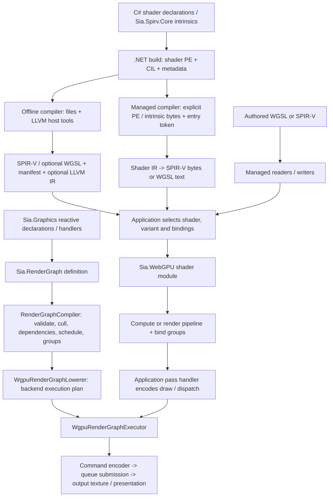
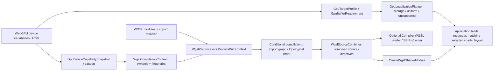
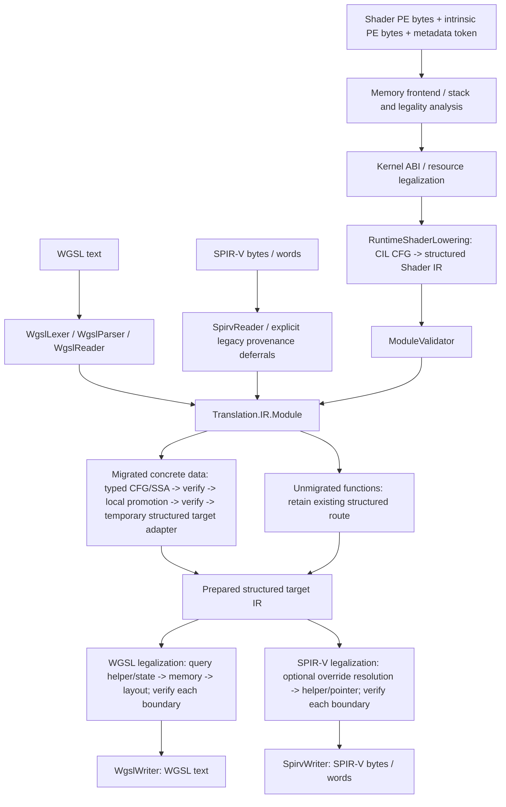
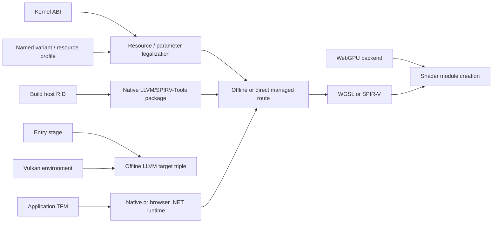
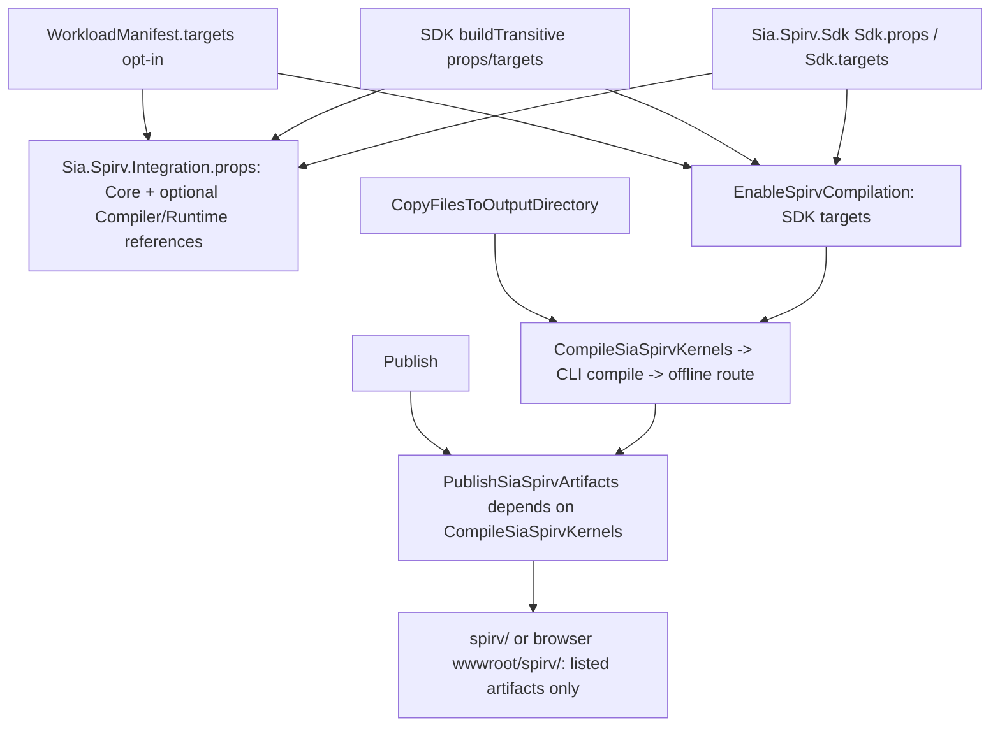

# Compiler and graphics pipelines

Current implementation based on PR 92, updated 2026-10-10. The
[improvement plan](compiler-roadmap.md) describes proposed changes separately.
Paths below are relative to this repository. The four shader routes exist for a
bounded shader subset; none establishes support for arbitrary managed programs.

Entry ABI preparation now builds target canonical wrapper CFG/SSA, including
interface reads/writes, argument assembly, workgroup initialization, output
conversion and mesh/task publication calls. The SPIR-V writer consumes the
prepared graph and per-entry interface identities. Target preparation also owns
entry execution modes, workgroup specialization policy, interface decorations,
their capability/extension requirements, override defaults/IDs and a typed
specialization instruction DAG. Internal emission accepts prepared data only;
the public writer remains the explicit options/target adapter. Deferred source
functions retain the legacy serializer, and operation/type feature policy and
structured frontend adapters still need migration. This does not establish full
frontend convergence.

SPIR-V high-level ray-query guards now lower on canonical graphs. Companion
state resets at each original query allocation; descriptor validity, traversal,
candidate type, generated-hit range and intersection/vertex reads become verified
control flow with ordered effects. Raw native query operations retain their graphs.
Owned Bodies are never re-read; only readable explicit deferrals are imported.
The former writer query-state/guard implementation is removed. Serialization
diagnoses any unlegalized high-level query operation; it no longer synthesizes
query semantics. Unreadable deferrals and remaining target adapters still require
migration. No new public interface or dependency is introduced.

The user approved removal of public legacy APIs on 2026-10-10, allowing breaking
changes. Public CIL/file/options adapters and request forwarding properties are removed.
Writer and translator entry points now require an explicit target, and writer
options no longer duplicate that target. The implicit-target paths are removed,
and maintained consumers have migrated. Internal frontend/target deferrals and
full consumer/research convergence remain the next architecture scope.

WGSL invocation termination now lowers on owned CFGs before structured
reconstruction. Shared CFG relocation handles terminating continuing constructs;
WGSL introduces demotion and typed returns while SPIR-V retains native termination.
Uniformity checks original non-returning paths before those target returns exist.
The old structured relocation path is retired. Return origins survive structured
and native import, SSA mapping, helper graph copying and target reconstruction,
including void returns replacing unreachable. Only explicit deferrals use the
remaining structured termination adapter.

WGSL target composition now retains canonical graphs for single-invocation
entry builtin facts, proven private-zero slots, pointer-helper expansion,
collective read recovery and uniformity. Graph-derived effects flow through
helper/recovery proofs; owned declaration Bodies are not re-read. Qualified or
escaping private slots remain unfurled. Explicit deferrals acquire graph ownership
only when recovery rewrites them. Empty inlined helpers retain their diagnostic
scope. Structured reconstruction is an explicit boundary before remaining WGSL
query-state, memory, layout and builtin-name passes; those semantic
adapters still need migration.

SPIR-V target preparation no longer reconstructs the entire module for deferred
pointer/query helpers. Readable explicit deferrals enter canonical graphs using
graph-derived callee effects; unreadable helpers expand through a structured
adapter restricted to their related callers. Other owned graphs retain identity,
and readable callers retain SSA results, captured addresses and native memory
operands. Target readers, entry wrappers and generated helpers use those same
effect summaries. Metadata discovers types from owned graphs and inspects Body
only for explicit deferrals. Native pointer-slot memory declares variable-pointer
capabilities from address space and proven storage origins; unsupported held
address spaces fail before emission. WGSL target migration and remaining
per-function semantic adapters are still open.

The shared middle-end now returns an internal `CanonicalModule`: owned function
graphs, borrowed declarations and explicit deferred bodies. Native frontend
graphs are copied before shared mutation. `ControlFlowAnalysisContext` shares
predecessor/dominance results between verification and local promotion; pass
records declare typed preservation. Module-level effect analysis reads graphs
and propagates call requirements before any structured adapter. Module verification
checks explicit body coverage, typed signatures and terminators before effect
analysis, preserving validation diagnostics for malformed graphs. Local promotion
preserves edge identity and dominance; replacing edges requires predecessor
invalidation, while topology changes invalidate both.

`CanonicalShaderPipeline.Run` is the explicit compatibility adapter over
`Prepare`. Ordinary SPIR-V target preparation retains these graphs through
integer, entry and physical-layout lowering. Integer safety and signed remainder
helpers are constructed directly as typed SSA, preserving caller result identities,
captured operands, topology and diagnostic origins. Pipeline constants resolve
directly in canonical declarations and graphs, preserving result IDs, typed edges,
captured addresses, spans and native memory operands. Only deferred functions use
the existing Body mapper. Prepared target resource checks follow graph calls and
symbols, retaining descriptor-array limits after resolution. Target-deferred pointer
merges legalize selected memory arms without visiting other declaration bodies.
Owned pointer-argument/return helpers expand directly with the existing CFG
inliner, retaining caller SSA IDs, captured addresses and lexical diagnostics.
Borrowed callees are copied; helper pruning accounts for graph and deferred calls.
Native canonical pointer parameter spaces remain legal at internal target/constant
entrances; public WGSL source restrictions are unchanged. Image, sampler and
acceleration-structure helper arguments now enter canonical graphs. Query locals
retain opaque allocation identity and vertex-return type without ordinary data
zeroing or stores. Their structured adapter declares and resets query state at
the original allocation, including each loop iteration. Shared effect facts
distinguish query updates from getters; query results remain conservatively
nonuniform. Source legality and borrowed graph ownership remain enforced.
Unreadable deferred pointer/query families use only the related per-function
helper adapter. Invocation termination
uses owned CFGs directly: terminating continuing instructions become loop-body
code, nested continue exits reconverge through distinct typed joins, and a common
latch forwards evaluated backedge values. Former break-if branches receive body
selection merges; absent backedges retain target-only structural continuation.
Existing SSA identities, ordered operations and termination origins survive, and
borrowed graphs are copied. Only explicit deferred bodies use the reader adapter.
The serializer consumes these prepared facts. WGSL target preparation
also retains its structured semantic path. The internal entry and physical-layout
entrance accepts `CanonicalModule`, retaining executable
graphs and copying borrowed graphs before target mutation. A legacy `Module`
entrance explicitly captures eligible graphs. Target-deferred owned functions
adapt their executable graph per function, rather than reading obsolete declaration
bodies. This is partial target migration; public frontend routes and the complete
shared canonical-to-target path still need conversion.

Workgroup layout access now maps owned SSA graphs: physical pointer signatures,
results, call return types, block arguments and captured addresses stay typed
together. Ordered aggregate reads/stores use explicit to/from conversion calls;
native operands, source spans and diagnostic filters survive. The structured
workgroup adapter handles explicit deferrals only. Target re-preparation retains
existing graphs and structural labels, registering new mesh publication helpers
without rebuilding graph-owned bodies. Canonical module validation checks the
actual executable graphs. Raw pointer-return signatures publish variable-pointer
capabilities in target metadata. Physical type discovery now reads captured graph
values before rewriting access. Uniform helpers are built directly as typed CFG:
selected arms read physical columns, a merge parameter carries the logical result,
and the default arm returns zero. Call arguments use already captured SSA indices;
caller results, ordered effects and loop/edge identities remain intact. Leaf memory
operands and inherited member qualifications propagate into helper call effects
before mixed validation. Structured uniform access handles explicit deferrals only.
Pure workgroup conversion and position/depth output helpers are built directly
as typed SSA graphs with empty compatibility bodies. Their aggregate projections,
constructors and builtin identity remain explicit. Initialization still starts
from a structured constructor, but its first verified/promoted graph is retained
through layout instead of being reconstructed and captured again. Initialization
and mesh constructors, the shared semantic target entrance, explicit deferrals and
frontend/LLVM adapters still require migration; this is not an end-to-end cutover.

The structured adapter also recognizes native conditional exits whose target is
the current enclosing selection's declared merge. It keeps edge copies inside
each arm and emits the merge once in its caller; missing structure still produces
a diagnostic. This fixes the optimized LLVM SpeculativeSelection input that was
also rejected by frozen compiler 4347B236… (R3 source 2FC5BD44…). It does not
eliminate the remaining structured frontend/target adapters.

Module validation can consume the canonical module directly: declaration,
signature and entry checks remain shared; instruction/terminator facts feed
transitive stage, call and payload rules. Explicit deferred bodies retain their
structured semantic gate. Effect summaries likewise resolve owned graph bodies.
Native CFG import no longer materializes structured bodies before shared passes,
including uncalled native helpers. The public Module output is still an explicit
adapter, and later target/frontend adapters still require migration.

Target memory qualification now reads SSA address provenance directly for
graph-owned functions. Address-path decorations propagate through aliases,
member projections, selects and block parameters; aggregate type requirements
are applied at the access site. Function snapshots preserve native operands
without inheriting resource decorations. Target calls inherit qualified memory
effects from the graph closure. The legacy structured qualification pass handles
only explicitly deferred functions. Target synchronization now expands directly
in owned graphs after memory qualification: typed barriers and default atomic
operands use shared policy, and collective reads become barrier/read/barrier at
their already evaluated SSA address. Results, diagnostic metadata and CFG edges
remain intact; effects are recomputed after target changes. The structured
synchronization adapter also handles only explicit deferrals. Target layout/pointer
adapters still precede graph preparation and require migration.

## Project flow and ownership

The render-graph compiler schedules resource access; the shader compiler translates
programs. There is no automatic edge from graph compilation to CIL compilation.
Application handlers create/use pipelines and bind shader resources. A graph output
texture is a rendering resource, not a shader compiler target.

| Owner / source | Responsibility and boundary |
| --- | --- |
| `Sia.Spirv.Core/` | Shader attributes, value/resource types and intrinsic declarations; no host tool execution |
| `Sia.Spirv.Compiler/SpirvFrontend.cs`, `Metadata/`, `Analysis/`, `Model/` | PE metadata, CIL decode/stack/legality checks, shader discovery and logical kernel model; input PE is data, not loaded CLR code |
| `Sia.Spirv.Compiler/Legalization/` | Resource/physical-layout choices for kernel ABI and target profile |
| `Sia.Spirv.Compiler/IL/` | CIL CFG utilities and direct managed lowering; unsupported CIL diagnoses |
| `Sia.Spirv.Compiler/Translation/` | Typed shader representation, readers, validation, shared transformations, target legalization and emission; no native process requirement |
| `Sia.Spirv.Compiler/Translation/IR/ControlFlow/`, `Valid/ControlFlowVerifier.cs`, `Valid/ModuleValidator.Canonical.cs` | Internal typed CFG/SSA, ordered memory effects, deterministic dumps, def-use/edge/access verification and shared numeric signature rules for migrated concrete data |
| `Sia.Spirv.Compiler/Translation/CanonicalShaderPipeline.cs`, `Proc/` | Per-compilation shader-entry reachability/dominance and concrete data local promotion; optional before/after traces and explicit deferred-feature reports |
| `Sia.Spirv.Compiler/Translation/Proc/UniformityAnalysis.cs`, `UniformityAnalysis.Canonical.cs` | Shared per-compilation control/value dependencies and bottom-up helper/pointer-content requirements; verified CFG/SSA instructions, incoming edges and function-memory dependencies, with explicit unmigrated-family fallback |
| `Sia.Spirv.Compiler/Translation/Proc/PointerAliasAnalysis.cs`, `PointerAliasAnalysis.Canonical.cs` | Shared root identities and bottom-up read/write footprints; target checks consume verified SSA instructions/edges, with structured source legality and unmigrated-family fallback |
| `Sia.Spirv.Compiler/Translation/Legalization/` | Ordered target preparation over canonical graphs with explicit structured adapters; WGSL memory/layout lowering; validates input and each pass result |
| `Sia.Spirv.Compiler/Translation/Back/` | Public writer composition adapters and target emission; SPIR-V bytes/words share one preparation path |
| `Sia.Spirv.Compiler/LLVM/` | Offline LLVM emission, SPIR-V repair and host tool process boundary |
| `Sia.Spirv.Compiler/Compilation/` | Public compilation entry points and offline files, hashes, manifests, variants and cache orchestration |
| `Sia.Spirv.Runtime/` | Artifact metadata, integrity/path checks, named variant lookup and buffer mapping; no compilation or GPU ownership |
| `Sia.Spirv.Tool/` | CLI file I/O and command diagnostics for compile/translate/validate |
| `Sia.Spirv.Sdk/`, `Sia.Spirv.Workload.Manifest/`, `Sia.Spirv.Bootstrap/` | Build integration, package selection and workload installation |
| `Sia.Spirv.Toolchain.{win-x64,linux-x64}/` | Offline LLVM/SPIRV-Tools binaries and licenses, selected for the build host |
| `Sia.RenderGraph/` | Backend-neutral graph definition, resource dependencies/lifetimes, validation and scheduling |
| `Sia.WebGPU/` | WebGPU handles/bindings, shader modules, pipelines, graph lowering/execution and GPU resource pools |
| `Sia.Graphics/Reactive/` | ECS/reactive registration and graph rebuild/execution coordination; borrows the configured device/queue |
| `Sia.Graphics/Wgsl/` | Authored-source conditional preprocessing, import graph and source combination; distinct from Compiler's WGSL semantic reader |
| `Sia.Graphics/Compatibility/` | Device capability snapshots/catalog, WGSL symbols and use-site buffer legalization; no implicit conversion to a compiler resource profile |
| `Sia.Graphics/Text/` | Font decoding, shaping, glyph rasterization and atlas data; consumers own GPU upload/draw composition |
| `Sia.WebGPU.Native/`, `Sia.WebGPU.Generators/` | Native/browser binding assets, backend selection and header-based binding generation |
| `tools/compiler-validation/` | Consumer and execution checks; not an SDK-distributed compiler runtime |

The registry owns graph plans, exported graph resources, view cache and resource
pool, disposing them with the addon. Device/queue are borrowed. Application code
owns shader/pipeline/bind-group handles and their release. Managed compiler calls
own temporary PE readers; returned module/bytes/text belong to the caller. Offline
compilation owns task files and child processes; it does not own a GPU device.

## Authored WGSL and device compatibility

`WgslCompilationContext` hashes its `targetIdentity` constructor input and symbols
into a fingerprint; it does not select an LLVM backend. Graphics' `GpuTargetProfile` describes
queried runtime device limits, while Compiler's `SpirvTargetProfile` describes a
compilation resource policy. They are separate current types and require explicit
use-site mapping when used together. Preprocessing handles conditional/import
syntax; semantic type/target validation belongs to the shader compiler/device.
Offline artifacts are selected through `SpirvArtifactRegistry` by source method
and target name; ambiguous unnamed selection fails. The caller must check layout
and capability requirements against the device before binding/executing them.

## Offline IL compilation

Entry points: `SpirvCompiler.CompileAssembly` and `CompileVariants`; implementation
in [Compilation/SpirvCompiler.cs](../Sia.Spirv.Compiler/Compilation/SpirvCompiler.cs)
and [LLVM/LlvmToolchain.cs](../Sia.Spirv.Compiler/LLVM/LlvmToolchain.cs).

```mermaid
flowchart LR
    PE["PE file"] --> Front["SpirvFrontend.Analyze: kernel + CIL CFG"]
    Front --> Legal["SpirvLegalizationPlanner: ABI / resource profile"]
    Legal --> Emit["LlvmIrEmitter: raw LLVM IR"]
    Emit --> Opt["opt: configured or default passes"]
    Opt --> LLC["llc: SPIR-V target triple, backend O0"]
    LLC --> Repair["Matrix / signed conversion / workgroup initializer repair"]
    Repair --> Val1["spirv-val: selected Vulkan environment"]
    Val1 --> Web["WebGPU ABI: optional spirv-opt -O"]
    Web --> Access["Resource access decoration repair"]
    Access --> Val2["spirv-val again"]
    Val2 --> SPV["SPIR-V artifact"]
    SPV --> WGSL["Optional managed SPIR-V reader -> IR -> WGSL writer"]
    SPV --> Manifest["Manifest / binary hash / layout hash / artifact list"]
```

The default `opt` sequence starts with `sroa,mem2reg,lower-switch,structurizecfg,
simplifycfg`; nonzero optimization without native atomics adds `early-cse,sccp,
adce,simplifycfg`. `llc` remains O0 because later code motion can break SPIR-V
merge placement. `OptimizationLevel` is therefore not a promise of backend O2/O3.
`CompileVariants` repeats this route with named resource profiles, orders names
deterministically and deduplicates identical binaries into `objects/<sha>.spv`.
Each variant retains its own manifest, layout identity and optional text output.
The file cache checks source/tool/compiler/profile/compilation-target identities
and binary integrity. New manifests record `CompilationTargetSha256`, the fixed-schema
identity of the selected target. Older manifests may omit it; runtime loading does
not infer device compatibility from this hash.

## Managed IL compilation and shader translation

SPIR-V target preparation now owns function CFG ordering, selection merges,
loop header/body splitting, continue targets and unreachable structural backedges
in `SpirvControlFlowLowering`. `SpirvPhysicalLayout` carries verified canonical
graphs and target structural facts; both raw physical preparation and final entry
preparation populate them. `SpirvWriter.ControlFlow` serializes those edges,
ordered operations and native phi values without reconstructing function bodies.
Runtime array lengths retain prepared buffer/member identities, and resource
handle values remain distinct from image-atomic address operands.

This is incremental: unmigrated pointer merges, ray-query guards and opaque data
families have explicit deferral reasons; the legacy function emitter and entry
wrapper still construct control flow. Frontend structured adapters and capability
policy also remain. The E9696BE8… snapshot records 128 normal routes with 363
canonical functions, not every accepted function family. It includes 210 format
checks and replay of 41 original frozen inputs (82 input/output checks), 153
reverse routes and 628 deterministic files. GPU results are 74 PASS/6 ERROR of
80; three non-void loop-return WGSL imports fail alongside three VMM imports.
The SPIR-V loop-return case passes. These checks do not close full parity or the
browser/SDK/Linux/AOT/research gates.

`CompileModule(SpirvModuleCompilationRequest)` returns `Translation.IR.Module`;
it does not emit files, cache artifacts or run LLVM. The request carries shader
PE bytes, an entry token, optional matching intrinsic PE bytes and an immutable
`SpirvCompilationTarget`. It borrows the input buffers for the call; callers keep
them unchanged. Target validity is checked before PE analysis. The new memory
and `CompileAssembly(SpirvFileCompilationRequest)` APIs share the same target
default: WebGPU ABI, Vulkan 1.2 environment, SPIR-V 1.5 and the default resource
profile. File/process choices stay on the file request. The CLI shares that WebGPU
default; `--abi vulkan` selects Vulkan explicitly. SDK targets retain WebGPU/WGSL defaults.

The old PE/token/options and path/output/options overloads and
`SpirvCompilationOptions` are removed. Callers construct a memory or file request
and set ABI/profile through `request.Target`; the memory request's former
forwarding properties are removed too. `CompileVariants(request, targets)` accepts
the existing file request and named resource profiles. Each variant replaces only
`request.Target.ResourceLimits`, preserving its ABI/version/feature contract.
The profile JSON format remains supported. This is a breaking source/binary change;
external callers must migrate and recompile. Maintained CLI and tests use the new API.

`SpirvCompilationTarget` combines environment/version, ABI, resource limits,
allowed stages, SPIR-V capabilities/extensions and WGSL enables. Null policy sets
explicitly allow implemented features; empty sets allow none. Policy membership
compares numeric identifiers by value and names ordinally, independent of caller
set comparers. Target identity is order/culture independent and includes the
unrestricted/empty distinction. Explicit managed SPIR-V
targets select versions 1.3 through 1.6; Vulkan 1.2 rejects 1.6. The offline LLVM
triple uses the selected version and rejects the managed-only `universal` environment.
WGSL output requires WebGPU ABI. Stages are checked before target preparation;
emitted capabilities/extensions/enables are checked before returning output.
SPIR-V descriptor limits run after supplied override values are resolved. Resource
checks follow each entry's helper calls and lexical global uses. They constrain
binding counts and known minimum buffer sizes; full physical ABI and actual host
binding allocation still require separate proof. These checks do not replace
external environment validation, complete uniformity or device feature negotiation.
Output format remains selected by the writer/file output flag; coordinate/depth,
workgroup initialization and instruction policies still reside in writer options.
`SpirvWriter.Write(module, target, options)` and `WriteWords` require a target;
`WgslWriter.Write(module, target)` has no target-free overload. Both translator
directions also require the target before optional reader/writer options. Null or
invalid translator targets fail before parsing input. There is no implicit writer
version selection: callers explicitly choose `SpirvCompilationTarget.Default`
(1.5) or another valid version. LocalSizeId callers select Vulkan 1.3 or universal
explicitly. CLI translation and Dawn's managed fallback choose the shared default.
Maintained tests/exporters and native/browser consumers have migrated; external
source/binary consumers must update and recompile.

`ShaderTargetLowering` composes the existing passes as fixed internal functions;
each boundary runs `ModuleValidator`. WGSL memory and layout transformations
live in `Translation/Legalization`, outside emission. Public `*.Pipeline.cs`
writer adapters prepare the module then call the emission implementation.
SPIR-V byte and word output use the same preparation and emission path.
Passes and emitters borrow the caller's module without modifying it, including
on failure. Results of internal passes may share unchanged nodes with the input;
this does not make the public mutable IR safe for concurrent caller mutation.

| Requested route | Existing composition | Current limit |
| --- | --- | --- |
| IL -> WGSL | `CompileModule` -> `WgslWriter.Write` | Supported CIL/intrinsics and WGSL-representable shader features |
| IL -> SPIR-V | `CompileModule` -> `SpirvWriter.Write` with required request target; offline route above also exists | Target constrains version/stage/capability policy on every public route |
| WGSL -> SPIR-V | `ShaderTranslator.WgslToSpirv` -> WGSL reader -> IR -> SPIR-V writer | Overrides may need `SpirvWriteOptions.PipelineConstants`; optional LocalSizeId needs matching target support |
| SPIR-V -> WGSL | `ShaderTranslator.SpirvToWgsl` -> SPIR-V reader -> IR -> WGSL writer | Native capability/memory/pointer features without equivalent WGSL produce diagnostics |

The public IR remains mutable structured blocks/expressions, with WGSL enables,
diagnostic filters and SPIR-V memory metadata. Both output pipelines now invoke
the internal canonical middle-end for concrete scalar/vector/matrix/finite-array/
structure data in shader entries and reachable data helpers with
storage access, branches, short circuit, switches and loops. A temporary frontend
adapter creates explicit terminators, SSA values and block arguments. Reachability
and dominance are recomputed per compilation; local promotion removes nonescaping
data slots while preserving ordered external loads/stores. Escaping or qualified
locals retain their declarations and explicit memory operations; value promotion
alone materializes implicit zero values. The verifier checks
definition/use dominance, edge arity/types, terminators and pointer access rights.
Numeric, construction, conversion, selection and projection signatures reuse
the structured validator's rules. Pure numeric intrinsic effect facts have one
shared table. Atomic, texture, derivative, subgroup and synchronization intrinsics
also carry explicit read/write, atomic, resource, convergence and ordering facts.
Control barriers and memory fences are distinct ordered instructions; native
execution/memory scopes, success/failure orders and memory-access metadata survive
the adapters. Immutable local pointer aliases capture indices before later calls,
and explicit address declarations remain visible to target legality checks.
Optional traces record pass dumps and analysis invalidation without a global cache.
SPIR-V integer safety and signed remainder expansion now run in target
legalization before serialization. `EmitIntegerDivisionChecks` selects whether
zero/overflow divisor guards enter prepared IR; signed remainder keeps its
existing quotient/product/subtraction expansion even when guards are disabled.
Generated ordinary typed helpers bind both operands once in evaluation order,
including scalar/vector broadcasts and 16/32/64-bit integers. They are checked
by the common CFG verifier before and after promotion. No public IR node, package
or pass framework is added. Floating division stays unchanged; specialization
expressions and constant-error checks retain their existing separate handling.
The serializer emits the supplied operations and does not add integer guards or
signed remainder expansion. `SpirvEntryPointLowering` now selects coordinate/depth
conversions before emission, adding verified pure typed functions and an internal
entry/member-to-function map. The serializer calls the selected function on the
already evaluated return value or mesh field load. Entry bodies keep their original
call semantics; mesh conversion stays after the publication barrier and inside
the existing output copy loop. Both public output forms consume this prepared
result; raw serialization does not read either policy flag. No new public IR/API
or dependency is introduced. Physical layout, mesh publication/control
construction and other target decisions still require extraction.
Implicit SPIR-V workgroup initialization now belongs to entry target legalization.
It produces a typed helper with first-invocation stores, qualified atomic memory,
specialization-length loops and an unconditional collective barrier. Shared CFG
verification/promotion and the natural structured target adapter prepare that
helper; the internal entry map specifies the wrapper call before user code.
The serializer does not read ZeroInitializeWorkgroupMemory or synthesize its
control flow. Default/opt-out and native explicit-initialization behavior remain.
Initializer-only workgroup globals enter 1.4+ entry interfaces through transitive
helper uses. Aggregate zero serializes as OpConstantNull, preserving its meaning
when an array length becomes specialized. No public IR or dependency is added.
Full frontend, physical-layout and mesh publication/control convergence is pending.

Physical type and layout preparation is now explicit in SpirvPhysicalLayoutLowering.
After entry helpers are verified, it records global physical/declaration types,
block wrappers, uniform small-matrix columns/member positions, separate workgroup
aggregate identities, and buffer ArrayStride/Offset/MatrixStride. Read-only maps
and member lists are frozen per compilation; the module remains borrowed mutable
IR. The serializer consumes this plan and no longer performs TypeLayout calculations
or creates these logical-to-physical mappings. Raw internal fixture emission also
requires an explicitly prepared plan; public writers keep their existing API.
Workgroup value conversions now have pure typed to/from helpers prepared by
SpirvWorkgroupValueLowering using logical/physical identities. The target result
owns a module list copy and frozen helper mapping. SpirvWorkgroupAccessLowering
then rewrites workgroup global/address types and pointer signatures to physical
identities, placing conversion calls explicitly at ordered loads/stores. A physical
workgroupUniformLoad result is converted through a pure helper after capture;
it does not re-read workgroup memory. Scoped aliases, legacy implicit value loads
and unresolved user-function identity are retained. Modified function bodies are
copied; borrowed input remains unchanged. Initializer/output mappings identify
final prepared functions. Shared verification checks helper/data types and effects.
The serializer emits these explicit calls and pointer types; it no longer chooses
their conversions. SpirvWriter.WorkgroupLayout.cs is removed. Normal entry module
validation and existing raw-native fixture gates retain their separate contracts. Pending-length
and atomic aggregates are not first-class data values; their element/atomic memory
operations retain their own path. SpirvUniformAccessLowering now prepares uniform
physical reads and aggregate reconstruction in directly generated CFG helpers for
owned functions. Dynamic-column selection is an explicit switch with a zero
fallback and SSA merge parameter; pointer alias indices use already captured SSA
values. The structured adapter remains for explicit deferrals. Mixed CFG validation
checks helpers and caller memory effects; the serializer no longer owns virtual
uniform aliases or builds these
selection/construction operations. Target module copies preserve borrowed input
globals and original function bodies. ShaderMemoryRequirements centralizes existing
memory qualification rules. SpirvMemoryAccessLowering materializes these rules on
ordered access/atomic metadata after physical preparation and on generated mesh
publication bodies. Scoped aliases capture inherited global/member qualifications;
function snapshots preserve existing native operands without inheriting logical
member flags. Coherence, volatility, alignment and scopes remain explicit, including
ordinary/atomic workgroupUniformLoad. Validation recognizes cooperative-required
Vulkan memory semantics and retains sequential atomic rejection. The serializer
no longer derives PointerMemory/AccessMemory/VolatileAccess or tracks alias memory
requirements. Final initializer/output/publication mappings refer to final functions.
SpirvSynchronizationLowering materializes default barrier/atomic operands after
physical/memory preparation, including generated entry/publication bodies.
Collective loads capture ordered operands and expand to barrier/read/barrier with
an explicit captured result. Native operands and memory qualifications survive;
serializers diagnose missing prepared operands instead of deriving defaults.
Final maps refer to rewritten functions. CollectiveReadRecovery proves isolated native default workgroup barrier/single
constructible load/barrier regions using shared CFG uniformity. Requirement origins
survive actual helper binding; failed candidates and their dependents fall back.
Only proved regions recover workgroupUniformLoad semantics in WGSL target IR.
Source WGSL barriers are excluded; qualified/nondefault or intervening-effect
regions remain unchanged. Graph copying owns mutable edges and preserves allocator
counters. Ordered/RawOrdered reverse loops now pass on identical input binaries;
four-invocation execution and changed aggregate reverse outputs are verified.
Other native/atomic regions and frontend/target convergence remain open; no
uniformity gate has been disabled. WGSL continuing has a nested scope consistent with
validation, retaining visibility of loop-body declarations until shadowed.
SpirvMeshPublicationLowering prepares the post-body workgroup barrier, bounded
mesh counts, distributed vertex/primitive copies and output conversion calls in
typed helpers after physical layout. MeshStore carries an output field/index/value;
MeshSetOutputs is a convergent write, and TaskDispatch is a terminating collective
operation with dimensions/payload identity. Shared CFG verification, effects and
canonical/structured uniformity retain these constraints. The serializer declares
specified output interfaces and emits these nodes; it no longer chooses count,
copy or synchronization algorithms. Entry interface closure includes publication
helpers, and task wrappers terminate after the dispatch helper. No public API or
dependency is added. Other target memory/control-flow and frontend convergence
remain incomplete; actual mesh/task GPU execution needs an extension-capable device.

The internal structured adapter now retains resolved function/builtin call identity.
WGSL parsing and native instruction decoding set it; CFG validation and target
reconstruction preserve the existing Call/Builtin distinction. Shared call closure,
effects, alias/uniformity analysis and helper expansion consume that identity.
User calls are not folded or sent through builtin-specific memory/query lowering
because their names match a builtin. Public legacy constructors remain name-resolved.
WGSL legalization disambiguates ordinary lexical names that would hide a required
builtin, retaining types, scoped references and IO/binding metadata. Entry names
and name-based override contracts are preserved; an unavoidable collision diagnoses
instead of silently renaming that consumer contract. Numeric-ID overrides keep IDs.
Typed calls retain arguments, return types and native memory metadata. Calls
retain conservative read/write and unknown-effect flags despite the partial
access summaries used for target legality. Per-compilation helper closure propagates
intrinsic convergence, synchronization, resource and memory requirements, and
the verifier rejects calls that omit those requirements;
they cannot be duplicated, removed or reordered as pure expressions.

Helper pointer parameters now enter canonical IR with their original address
space/access. Typed pointer symbols represent memory addresses; target reconstruction
distinguishes dereferenced parameter places from pointer values passed to calls.
Nested helper forwarding preserves that distinction. Escaping local slots retain
ordered memory operations; captured indices and same-address arguments remain
stable through promotion. Finite pointer block merges now lower to scalar address
tags and captured index slots; simultaneous edge copies preserve loop-carried
swaps before selected-address memory dispatch. Pointer helpers expand before that
dispatch so unconditional convergent operations remain outside its branches.
Natural loop header exits are reconstructed from verified loop annotations.
Called pointer-return helpers now expand directly on verified CFG. Arguments are
existing SSA values, callee symbols bind to those values, and real return edges
join the returned addresses. Single-arm selections provide helper exit regions;
nonlocal exits leave nested breakable regions in order and reset their flags for
each dynamic call. Shared alias/uniformity analysis prepares these expanded graphs
without modifying its borrowed input. Returned callee-local addresses still require
lifetime legalization; expanding them must not extend their function storage lifetime.
Expanded instructions retain explicit callee diagnostic scopes and restore inherited
or default rules only when the caller differs. Equal defaults introduce no compound
attributes; caller block controls must not leak into a helper's lexical scope.
Opaque local data and complete frontend convergence remain pending.
WGSL default-zero mutable declarations receive explicit typed initializers in
their frontend and become stores at the original CFG position. Native declarations
retain their original initialization operations. `Statement.Declare.Initialize`
defaults to true for existing callers; false is allocation only and requires a
mutable declaration with no initializer. Canonical reconstruction uses that fact
to avoid a second initialization at function entry. The SPIR-V emitter serializes
the explicit stores; WGSL syntax supplies its mandatory zero initialization for
the allocation. Native concrete allocations/SSA placeholders preserve absent
initializers, and no-default-zero memory is retained conservatively by promotion.
Uniformity treats that memory as unknown until an explicit store proves otherwise.
This initializes escaping slots for each dynamic
helper invocation. Value promotion retains addresses used by returns or incoming
edges, as well as addresses escaping through instructions.
SSA signature checks must resolve an
argument before a same-named global, including qualified native memory accesses.

Shared pointer alias analysis records root identities and bottom-up memory-access
footprints for parameters/globals. It validates authored WGSL sources and target
IR after helper expansion and after the remaining target passes. Written aliases diagnose even when the other pointer
parameter is unused; projections share their originating root, and transitive
global accesses participate. Readonly aliases and distinct roots remain valid.
Collective/cooperative loads read their pointer operands without turning ordering
effects into operand writes. Native SPIR-V output retains aliases. The shared
`Proc/HelperInliner` now expands pointer helper calls for both targets, retaining argument
order, captured indices and alias identity without copy-in/copy-out. Target
preparation selects the expansion; authored illegal alias calls still fail during
source validation. Uncalled WGSL pointer library functions remain available;
native reader specialization retains its previous unused-helper pruning. SPIR-V
serialization passes the supplied addresses directly; it no longer creates
per-parameter copies and writes them back after a call. That former behavior lost
same-address alias semantics even when independent format validation passed.
Target alias analysis now consumes verified CFG instructions and SSA edge
arguments for migrated functions. Root sets converge across selections and loop
backedges before checking calls; both forms share the same parameter/global
read/write summaries and alias rule. The existing structured frontend adapter
still supplies graphs during migration, and unsupported families retain the
structured analysis with an optional explicit deferral report. Static WGSL source
checking includes unreachable statements that canonical reachability removes.
These summaries do not authorize alias-based optimizations. Finite canonical
pointer block arguments now have separate target legalization. Eligible native
pointer-return families read original SPIR-V, retain single-evaluation call/select
snapshots and enter the same verified CFG expansion. Native capability, storage
space, matrix-containing pointee and storage-buffer root restrictions are checked
on expanded addresses before target dispatch. The internal `ValidateNative`
structured adapter accepts native pointer parameters/select; the public WGSL
validator retains its gate. This temporary adapter is not a completed independent
common verifier. Eligible pointer-return and pointer-phi modules share one importer
for native blocks and
terminators directly, carrying scalar/pointer phis as block/edge arguments with
native merge/continue annotations. Existing typed expression translation is reused;
native topology is not reconstructed through the old Region/Edge-copy adapter.
Return-only modules follow this same path; the legacy region reader no longer
duplicates native pointer-return decoding. Direct native scalar phis are always
block parameters rather than preallocated result slots.
The common pipeline, entry-call closure and pointer-return helper expansion read
the supplied frontend graphs. Temporary structured metadata bodies are rebuilt
from expanded graphs; native scalar-result temporaries and output adapters remain.
Shape/capability validation runs before metadata reconstruction; root validation
runs after helper binding before target dispatch. Phi predecessor sets must match
all actual native edges, and incoming values must match their declared types.
Native Function pointer-slot loads/stores now enter the same typed CFG, including
CopyObject slot aliases and immutable snapshots at each load. Shared promotion
runs before metadata reconstruction and helper expansion; only allocation-only,
definitely assigned, non-escaping, unqualified slots migrate at this stage. Modules
with pointer loads alone also enter this path. Native load shape/capability checks
run before promotion and root checks run before address dispatch.
Function slot helper parameters now bind to actual caller addresses through the
same canonical helper copier, including void returns, nested forwarding and
repeated calls. Shared promotion runs again after expansion, before reconstructing
metadata; unused expanded slot helpers are retired from that adapter. No pointee
copy-in/copy-out or second binary provenance solver is introduced. Incompatible
slot parameter signatures retain their native transfer type-mismatch diagnostic.
Private/global slots retain explicit preflight deferrals. If shared promotion
leaves uninitialized, escaped or qualified slot memory, the reader records a
deferral and uses the original normalizer without reconstructing metadata. This
temporary exit reuses common IR facts; it does not duplicate binary definite-
assignment analysis or catch parse exceptions. Slot null/undefined, arithmetic/
comparison, atomic/opaque/physical-matrix, descriptor arrays, task terminators
and native pointer libraries still require migration. A parse error never silently
selects fallback.
Native data-helper expansion and layout transformations still require migration.
Ordinary native data/control flow now enters that direct CFG importer as well;
eligibility no longer requires a pointer return, phi or load. Scalar phi values
bind to block parameters and actual predecessor arguments before promotion,
without the legacy Region/Edge reconstruction. Scalar helpers retain calls and
ordered effects. Pending specialization-sized arrays retain an explicit preflight
deferral and their unresolved length identity; they are not assigned default or
runtime-array lengths to fit canonical types. Malformed eligible inputs report
their original instruction span instead of selecting the legacy route. The
structured expression/metadata adapter and target reconstruction still require
migration; this cutover does not make all native types canonical.
Native `OpUnreachable` now has an explicit non-returning canonical terminator
with its source span. The internal structured bridge preserves it through metadata,
helper copying and SPIR-V serialization; it supplies no return value or successor.
The legacy reader also retains this terminator. Shared control analysis treats it
as an exit, and uniformity summaries do not invent caller return contents.
WGSL legalization explicitly chooses a return (zero for constructible result data)
on source-undefined paths; in continuing it chooses fallthrough, where WGSL forbids
return. This target choice occurs after helper expansion, before WGSL validation,
and never changes canonical/native SPIR-V semantics or allocates zero pointers.
The [SPIR-V definition](https://registry.khronos.org/SPIR-V/specs/unified1/SPIRV.html#OpUnreachable)
provides no execution result for this path. Defined-path comparisons remain the
runtime acceptance criterion; the test interpreter rejects undefined execution.
Native continuing controls call an independent non-returning helper. A direct
terminating branch in a multi-block continue construct violates SPIR-V's
structural post-dominance rule; the internal WGSL continuing-marker check is
separate from independently validated native inputs. Non-returning call control
summaries now carry callee exit dependencies and whether a normal return remains
possible. Always-aborting calls contribute no normal successor phi/memory state.
General target structural verification remains pending.

Native OpKill has a separate internal InvocationKill terminator and bridge,
retaining spans and invocation/convergence effects through helper copying and
native serialization. It does not supply returned pointer contents. WGSL target
legalization checks native uniformity before converting this path to discard and
a typed return; discarded invocations have no later observable storage/output
writes. `InvocationTerminationControlFlow` now relocates continue constructs that
contain native kill after helper expansion for both targets. Verified SSA
reconstruction runs the old tail at the next loop header with a per-entry first
iteration guard: continue executes that tail, break skips it, and captured
break-if values retain their original order. Shared body/continuing values retain
their function-scope storage, and each dynamic loop entry resets the guard.
SPIR-V keeps OpKill; WGSL subsequently performs its discard/typed-return choice.
This avoids emitting a structurally invalid SPIR-V continue construct or a WGSL
return inside continuing. Task emission and complete structural verification
still require full convergence.

WGSL discard now enters canonical CFG as an ordered `Demote` instruction with
`Convergent | HelperDemotion` effects and normal fallthrough. Helper-local
computation and returns remain present; discard is not a return or native kill.
Shared stage validation restricts reachable demotion to fragment entries, and
uniformity retains control reconvergence after conditional demotion.
SPIR-V demotion (5380/capability 5379) imports through the same representation;
explicit termination (4416) retains its own terminator flag through helper
expansion and both target adapters. Target validation checks invocation capability
and extension policy before serialization. Outputs below SPIR-V 1.6 declare
the respective EXT/KHR extension; SPIR-V 1.6 uses the core instructions.
Dynamic helper-invocation queries (5381) now enter canonical IR as boolean,
ordered `HelperInvocation` values with `Convergent | ReadInvocationState` effects.
Their values remain nonuniform through helper summaries; queries before and after
demotion retain distinct evaluation positions, including unused native results.
They are independent of the initial HelperInvocation IO builtin. WGSL target
preparation explicitly rejects the dynamic query because WGSL has no corresponding
public query; native SPIR-V retains it and its capability/version requirements.
Derivative-quad GPU equivalence and initial helper IO convergence remain pending.
The emitter still assembles declarations; complete feature/layout preparation
extraction remains pending.
The shared `LocalValuePromotion` pass now handles definitely initialized,
non-escaping allocation-only data and pointer slots. Definite assignment intersects
all predecessor states, including loop backedges, and resets at each dynamic
allocation. Loads become SSA snapshots and parallel pointer edges preserve loop
swaps. Uninitialized, escaping and memory-qualified slots retain their explicit
memory operations; pointer allocations cannot request implicit zero addresses.
This common memory-IR support does not yet legalize Private/global slots, escaped
pointer lifetimes, undefined addresses and qualified pointer memory.
`Legalization/PointerSelectionLowering` owns selected-address dispatch shared with
the native reader. Reader callbacks preserve qualified memory and aggregate-copy
semantics; native capability and descriptor-snapshot facts stay explicit inputs.
The pass borrows its input and preserves lexical diagnostic filters. Its address
conditions and indices must already be captured; arbitrary effectful pointer
expressions require capture before this pass.

Shared uniformity analysis now tracks control/value dependencies, mutable local
merges and loop backedges, readonly versus writable global reads, pointer contents
and bottom-up helper requirements. Migrated functions consume verified CFG
instructions directly, with control dependencies, SSA incoming values and cyclic
function-memory nodes. Address origins are shared with alias analysis; loads and
strong/partial stores retain pointer-content dependencies. Iteration-crossing
continue paths do not reconverge at an ordinary postdominating block; loop exits
and early returns retain their distinct control dependencies. Builtin rules, input
facts, diagnostic filters and helper summaries are shared with the structured
fallback, which reports unsupported canonical families when requested. Analysis
does not reconstruct source statements. WGSL source validation and the WGSL target
pipeline invoke it; target validation runs after helper expansion and again
after target passes. Reconvergence requires the relevant paths to reach the next
statement. Derivative/subgroup diagnostic filters retain their lexical callee
severity. Existing `Block` metadata carries lexical diagnostic filters through
parsing, whole-module transforms and output; canonical instructions retain their
effective block filters for reconstruction. Inlining resets callee defaults when
the caller disables a rule, and continuing filters include `break if` expressions.
Execution barriers and workgroup uniform loads have unfilterable
requirements. Memory-only fences do not acquire execution-barrier requirements.
`WgslEntryPointLowering` exposes zero local invocation indices only when every
resolved workgroup dimension is one. Native private u32 IO slots fold only when
zero-initialized, all writes are zero and addresses cannot escape; qualified
memory and lexical name collisions exclude folding. Unresolved overrides do not
provide that proof, and source WGSL uniformity has no single-invocation exemption.
These passes preserve borrowed input modules. Non-error diagnostic records are
currently internal; public warning delivery and subgroup-uniformity scope
extensions remain pending, as does direct canonical-IR uniformity analysis.

The temporary target adapter reconstructs natural `if`/`switch`/`loop` control
from verified CFG selection merges and loop merge/continuing boundaries. Frontends
retain those facts without retaining source statements for target reconstruction;
reachability prunes unreachable boundaries and SSA promotion preserves them.
The verifier checks boundary ownership/dominance and that loop backedges pass
through continuing. Edge arguments use simultaneous snapshots; final break-if
conditions are captured before backedge copies can overwrite a header phi.
Missing, overlapping or unrepresentable regions diagnose rather than introduce
a dispatcher or fabricate a return value. The adapter preserves captured indices
and source spans. Loop body declarations remain visible in continuing, and
continuing locals remain visible to its break-if. Native references and indexed/
member places are normalized into explicit reads or typed addresses before
verification, retaining pointee address space/access and selected member requirements.
Entry call closure includes all shader stages; vertex/fragment data IO, data helpers
and direct CIL math kernels have actual migration regressions. Atomic/workgroup
synchronization, explicit texture operations, native barrier metadata and maintained
CIL synchronization/atomic kernels now have migration regressions. Pointer helpers
have actual WGSL/native-reader migration checks for scalar/composite places,
private memory, captured indices and loops. Abstract values and
opaque/atomic/cooperative local data remain on
explicitly deferred routes. Existing regression support
for those families is not canonical migration evidence. Retire
both adapters when direct frontends and target legalizers consume canonical IR,
with all four routes covered. These annotations currently come from the structured
frontend adapter. Arbitrary unannotated CFG region discovery, full reducibility,
complete convergence and uniformity coverage remain pending; natural control reconstruction
for the migrated slice does not establish those broader gates.

Input normalization remains in readers; SPIR-V emission still handles
physical buffer/IO layout, structured control and instruction-specific policies.
Moving the existing whole-module passes is only the first target boundary;
complete canonical type/effect coverage, target capability verification and
emitter extraction remain in the roadmap. Validation is not
complete WGSL uniformity analysis or a substitute for external SPIR-V validation.
Extended `wgpu_*` syntax accepted by the parser does not establish browser support.

`SpirvReadOptions.AdjustCoordinateSpace` and the corresponding write option
default to true; the writer also defaults to fragment-depth clamping and workgroup
initialization. Coordinate/depth policy is part of the route's semantics, so a
native roundtrip must choose compatible options rather than assume byte-preserving
translation. The roadmap moves these choices into explicit target configuration.

Memory inputs must contain the original shader IL and matching intrinsic metadata.
Trimmed/AOT application methods cannot be assumed to retain them; preserve the PE
as explicit application data. The compiler runs inside the application's existing
.NET runtime on native or Wasm. It does not execute shaders on a CPU Wasm backend.

## Target vocabulary and routing

| Dimension | Current selector / values | Affects |
| --- | --- | --- |
| Shader input/output | PE/CIL, WGSL, SPIR-V; reader/writer APIs | Conversion route and emitted representation |
| GPU execution environment/version | `SpirvCompilationTarget`: `vulkan1.2` / `vulkan1.3` / managed-only `universal`, SPIR-V 1.3-1.6 | Managed header/interface rules, selected LLVM version/stage triple and independent `spirv-val` rules; legacy offline options derive 1.5/1.6 |
| Shader ABI | `KernelAbi`: Vulkan / WebGpu | Push constants versus uniform scalar parameters, physical resource layout; WGSL offline emission requires WebGpu |
| Resource capabilities | `SpirvTargetProfile` | Storage/uniform limits, bounded read-only storage fallback, per-stage binding counts/sizes |
| Logical variant | `SpirvVariantConfiguration.Targets` name -> profile | Profile legalization, artifact name/layout/selection; not an LLVM target triple |
| Authored WGSL context | `WgslCompilationContext` target identity input, fingerprint and capability symbols | Conditional source/import preparation; independent of artifact variant name |
| Shader stage | CIL attributes: compute / vertex / fragment | Entry signature, stage IO, workgroup size and LLVM stage triple; translator extensions have a broader stage model |
| Managed host | `TargetFramework`: compiler net11.0; WebGPU net11.0 / net11.0-browser | Where compiler/binding code executes; not GPU code format |
| Native tool host | `SpirvHostRuntimeIdentifier`: win-x64 / linux-x64 | Which LLVM/SPIRV-Tools package runs during offline build |
| WebGPU backend | `SiaWebGpuBackend`: Dawn / Wgpu | Browser native glue and shader submission path; desktop bindings currently use wgpu-native |
| Build scheduling | MSBuild `Target` elements | When compiler/package/publish actions run; not device capabilities |

Native and browser Wgpu submit SPIR-V through their native entry. Browser Dawn's
`CreateSpirvShaderModule` calls the managed translator and submits WGSL; authored
WGSL goes directly to `CreateWgslShaderModule`. Selecting WebGpu ABI alone neither
selects Dawn nor proves every extension is available on the consuming device.

## MSBuild and distribution

Runtime-only workload consumers set `EnableSpirvRuntimeCompilation=true` and
`EnableSpirvCompilation=false`; this imports references without compiler targets.
The SDK distributes managed compiler/CLI assemblies; host
toolchain packages distribute native executables separately. There is no SDK
browser compiler runtime or JS loader. Bootstrap installs these packs; it does not
run for each shader. SDK package/reference integration uses the host's normal SDK
imports and guards against duplicate workload imports.

| Target / source | Trigger and relationship |
| --- | --- |
| `CompileSiaSpirvKernels`, SDK `Sdk.targets` | After `CopyFilesToOutputDirectory`; enabled, non-design-time, inner-TFM build only; requires host toolchain |
| `PublishSiaSpirvArtifacts`, same file | After `Publish`, depends on compile; copies `spirv-artifacts.txt` selection, with old-artifact glob fallback |
| `CollectSpirvSdkTools`, SDK csproj | TFM package content collection, depends on Build; collects CLI managed output |
| `ValidateSpirvToolchainPackInputs`, both toolchain csprojs | Before Pack; checks pinned executable/license staging |
| `GenerateSpirvWorkloadManifest`, manifest csproj | Before GenerateNuspec; generates workload metadata, not shaders |
| `SyncWebGpuHeader`, generator csproj | Before BeforeBuild; binding header acquisition, independent of shader translation |
| `ValidateSiaWebGpuBackend`, native targets | Validates backend/TFM selection before native build/publish preparation |
| `FetchWgpuBinaries`, native csproj | Before GenerateNuspec; native binding binaries, separate from compiler packs |
| `AddBrowserNativeModules`, browser example | Before `_GenerateManagedToNative`, depends on `PrepareForWasmBuildNative`; browser native modules |
| `RemoveBundledSpirvCoreReference`, examples | Before ResolveAssemblyReferences; removes duplicate bundled Core reference |
| `AssembleSiaWebGpuSite`, browser example | After `Publish;PublishSiaSpirvArtifacts`; publishes Dawn/Wgpu x WGSL/SPIR-V variants into the assembled site |
| `ValidateRunnerInputs`, validation GPU project | Before CoreCompile; checks diagnostic host and static fixture inputs |

## Dependency removal and evidence

The Sia compiler has no Rust Naga bridge, CLI process or compiler Wasm payload.
The independent research archive is retained on `chore/naga-managed-archive`
(`9dc9f21`), outside this PR's product tree.
The existing third-party wgpu-native backend internally uses Naga and is unchanged
by this PR cleanup. The user's scope clarification keeps this work focused on the
PR's own compiler/tooling changes; no claim is made about removing implementation
dependencies of existing external WebGPU backends.

`SpirvToolchainInfo` now exposes only LLVM, SPIRV-Tools and managed translator
identities. Removing its two retired positional parameters is a source/binary API
change for callers that used them; rebuild consumers against the new signature.
The artifact loader still ignores unknown JSON properties, so old manifests do
not need those fields modeled in the current API. Managed translation and identity
hashing now belong to `Compilation/SpirvCompiler.Translation.cs`, outside the
public native `LlvmToolchain` facade; its former translation methods are removed.

See [maintained verification](../tools/compiler-validation/README.md) for exact
commands and coverage. Format validation, roundtrip parsing, GPU execution,
browser runtime execution and packaging are separate evidence. Historical checks
do not automatically apply to changed source; current results belong in the
validation evidence and the execution plan.

R2 evidence correction: freeze stopped before creating the snapshot/evidence files.
The exact failing optimized input also fails in frozen compiler 4347B236…
(input SHA-256 3DB8FEB375D9909C46B511CF93DC396A360FFDDE80D4BE7C0A68C478DA481FA4).
This is a newly exposed existing enclosing-selection-exit defect, not proof
of a regression introduced by canonical module preparation. Reproduction and
baseline records are in `.work/compiler-architecture-first/canonical-module-offline-*`.
