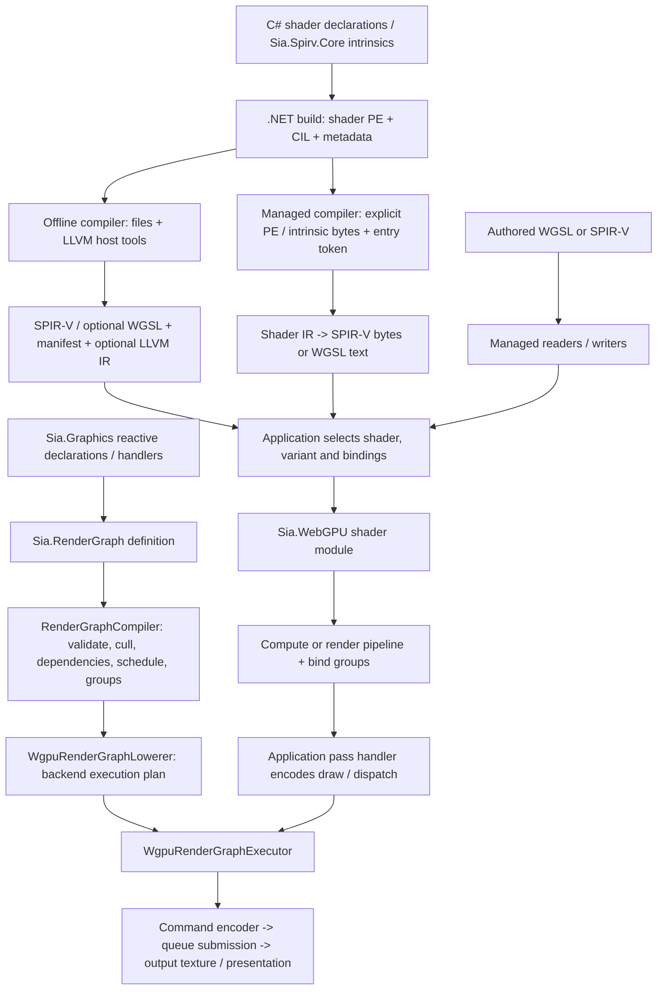
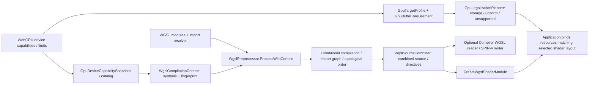
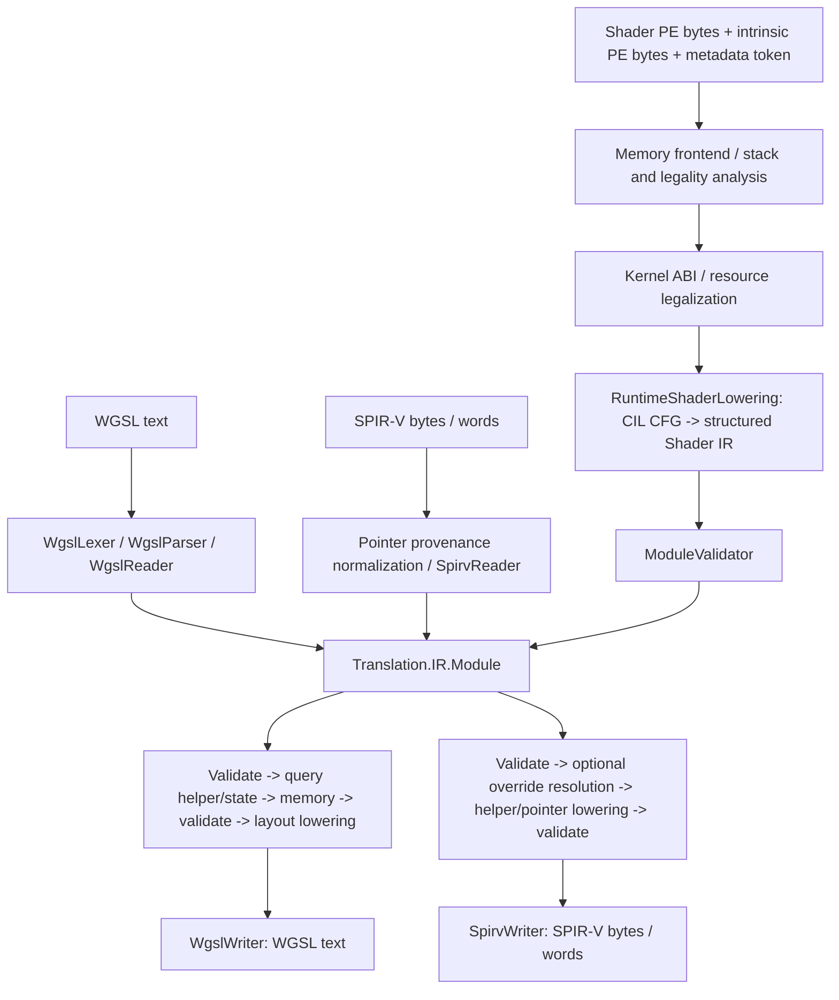
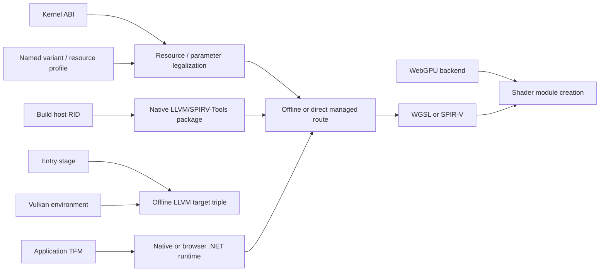
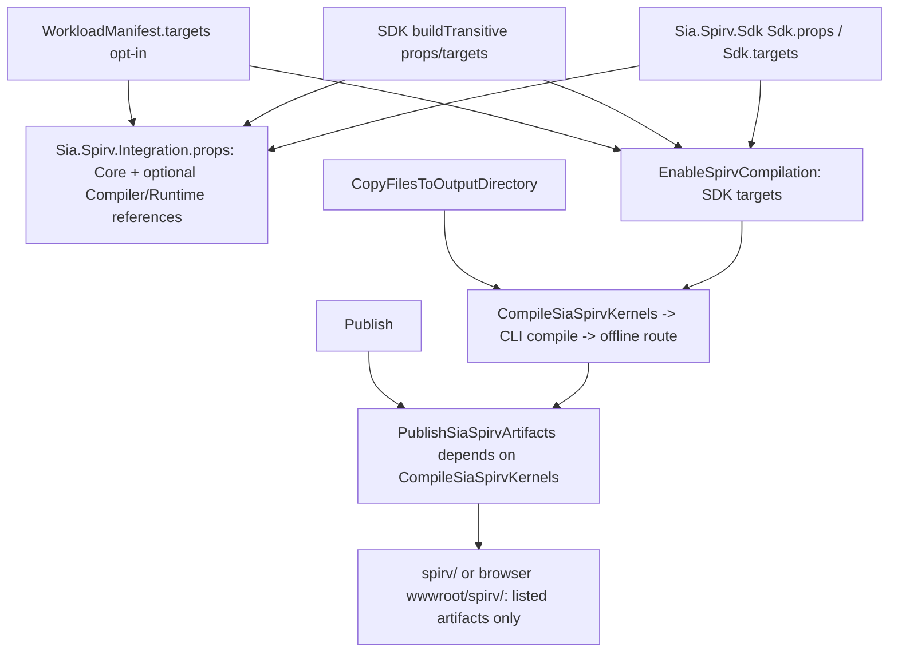

# Compiler and graphics pipelines

Current implementation for PR 92, inspected 2026-10-08. The
[improvement plan](compiler-roadmap.md) describes proposed changes separately.
Paths below are relative to this repository. The four shader routes exist for a
bounded shader subset; none establishes support for arbitrary managed programs.

## Project flow and ownership

The render-graph compiler schedules resource access; the shader compiler translates
programs. There is no automatic edge from graph compilation to CIL compilation.
Application handlers create/use pipelines and bind shader resources. A graph output
texture is a rendering resource, not a shader compiler target.

| Owner / source | Responsibility and boundary |
| --- | --- |
| `Sia.Spirv.Core/` | Shader attributes, value/resource types and intrinsic declarations; no host tool execution |
| `Sia.Spirv.Compiler/SpirvFrontend.cs`, `Metadata/`, `Analysis/`, `Model/` | PE metadata, CIL decode/stack/legality checks, shader discovery and logical kernel model; input PE is data, not loaded CLR code |
| `Sia.Spirv.Compiler/Legalization/` | Resource/physical-layout choices for kernel ABI and target profile |
| `Sia.Spirv.Compiler/IL/` | CIL CFG utilities and direct managed lowering; unsupported CIL diagnoses |
| `Sia.Spirv.Compiler/Translation/` | Typed shader representation, readers, validation, transformations and writers; no native process requirement |
| `Sia.Spirv.Compiler/LLVM/` | Offline LLVM emission, SPIR-V repair and host tool process boundary |
| `Sia.Spirv.Compiler/Compilation/` | Public compilation entry points and offline files, hashes, manifests, variants and cache orchestration |
| `Sia.Spirv.Runtime/` | Artifact metadata, integrity/path checks, named variant lookup and buffer mapping; no compilation or GPU ownership |
| `Sia.Spirv.Tool/` | CLI file I/O and command diagnostics for compile/translate/validate |
| `Sia.Spirv.Sdk/`, `Sia.Spirv.Workload.Manifest/`, `Sia.Spirv.Bootstrap/` | Build integration, package selection and workload installation |
| `Sia.Spirv.Toolchain.{win-x64,linux-x64}/` | Offline LLVM/SPIRV-Tools binaries and licenses, selected for the build host |
| `Sia.RenderGraph/` | Backend-neutral graph definition, resource dependencies/lifetimes, validation and scheduling |
| `Sia.WebGPU/` | WebGPU handles/bindings, shader modules, pipelines, graph lowering/execution and GPU resource pools |
| `Sia.Graphics/Reactive/` | ECS/reactive registration and graph rebuild/execution coordination; borrows the configured device/queue |
| `Sia.Graphics/Wgsl/` | Authored-source conditional preprocessing, import graph and source combination; distinct from Compiler's WGSL semantic reader |
| `Sia.Graphics/Compatibility/` | Device capability snapshots/catalog, WGSL symbols and use-site buffer legalization; no implicit conversion to a compiler resource profile |
| `Sia.Graphics/Text/` | Font decoding, shaping, glyph rasterization and atlas data; consumers own GPU upload/draw composition |
| `Sia.WebGPU.Native/`, `Sia.WebGPU.Generators/` | Native/browser binding assets, backend selection and header-based binding generation |
| `tools/compiler-validation/` | Consumer and execution checks; not an SDK-distributed compiler runtime |

The registry owns graph plans, exported graph resources, view cache and resource
pool, disposing them with the addon. Device/queue are borrowed. Application code
owns shader/pipeline/bind-group handles and their release. Managed compiler calls
own temporary PE readers; returned module/bytes/text belong to the caller. Offline
compilation owns task files and child processes; it does not own a GPU device.

## Authored WGSL and device compatibility

`WgslCompilationContext` hashes its `targetIdentity` constructor input and symbols
into a fingerprint; it does not select an LLVM backend. Graphics' `GpuTargetProfile` describes
queried runtime device limits, while Compiler's `SpirvTargetProfile` describes a
compilation resource policy. They are separate current types and require explicit
use-site mapping when used together. Preprocessing handles conditional/import
syntax; semantic type/target validation belongs to the shader compiler/device.
Offline artifacts are selected through `SpirvArtifactRegistry` by source method
and target name; ambiguous unnamed selection fails. The caller must check layout
and capability requirements against the device before binding/executing them.

## Offline IL compilation

Entry points: `SpirvCompiler.CompileAssembly` and `CompileVariants`; implementation
in [Compilation/SpirvCompiler.cs](../Sia.Spirv.Compiler/Compilation/SpirvCompiler.cs)
and [LLVM/LlvmToolchain.cs](../Sia.Spirv.Compiler/LLVM/LlvmToolchain.cs).

```mermaid
flowchart LR
    PE["PE file"] --> Front["SpirvFrontend.Analyze: kernel + CIL CFG"]
    Front --> Legal["SpirvLegalizationPlanner: ABI / resource profile"]
    Legal --> Emit["LlvmIrEmitter: raw LLVM IR"]
    Emit --> Opt["opt: configured or default passes"]
    Opt --> LLC["llc: SPIR-V target triple, backend O0"]
    LLC --> Repair["Matrix / signed conversion / workgroup initializer repair"]
    Repair --> Val1["spirv-val: selected Vulkan environment"]
    Val1 --> Web["WebGPU ABI: optional spirv-opt -O"]
    Web --> Access["Resource access decoration repair"]
    Access --> Val2["spirv-val again"]
    Val2 --> SPV["SPIR-V artifact"]
    SPV --> WGSL["Optional managed SPIR-V reader -> IR -> WGSL writer"]
    SPV --> Manifest["Manifest / binary hash / layout hash / artifact list"]
```

The default `opt` sequence starts with `sroa,mem2reg,lower-switch,structurizecfg,
simplifycfg`; nonzero optimization without native atomics adds `early-cse,sccp,
adce,simplifycfg`. `llc` remains O0 because later code motion can break SPIR-V
merge placement. `OptimizationLevel` is therefore not a promise of backend O2/O3.
`CompileVariants` repeats this route with named resource profiles, orders names
deterministically and deduplicates identical binaries into `objects/<sha>.spv`.
Each variant retains its own manifest, layout identity and optional text output.
The file cache checks source/tool/compiler/profile identities and binary integrity.

## Managed IL compilation and shader translation

`CompileModule` returns `Translation.IR.Module`; it does not emit files, cache
artifacts or run LLVM. Its default ABI is WebGPU. File compilation defaults to
Vulkan ABI, while SDK targets default to WebGPU ABI with WGSL emission.
The managed call currently accepts `SpirvCompilationOptions`, but only ABI and
resource profile drive direct lowering; LLVM passes, optimization level, output
flags and Vulkan environment do not configure the managed writers. Call writers
explicitly; this options mismatch is addressed in the roadmap.

| Requested route | Existing composition | Current limit |
| --- | --- | --- |
| IL -> WGSL | `CompileModule` -> `WgslWriter.Write` | Supported CIL/intrinsics and WGSL-representable shader features |
| IL -> SPIR-V | `CompileModule` -> `SpirvWriter.Write`; offline route above also exists | Direct writer has its own feature/version logic, not LLVM's target-environment switch |
| WGSL -> SPIR-V | `ShaderTranslator.WgslToSpirv` -> WGSL reader -> IR -> SPIR-V writer | Overrides may need `SpirvWriteOptions.PipelineConstants`; optional LocalSizeId needs matching target support |
| SPIR-V -> WGSL | `ShaderTranslator.SpirvToWgsl` -> SPIR-V reader -> IR -> WGSL writer | Native capability/memory/pointer features without equivalent WGSL produce diagnostics |

The IR is currently mutable structured blocks/expressions, with WGSL enables,
diagnostic filters and SPIR-V memory metadata. It is not a canonical CFG/SSA middle
end. Important transformations remain inside readers/writers. Validation is not
complete WGSL uniformity analysis or a substitute for external SPIR-V validation.
Extended `wgpu_*` syntax accepted by the parser does not establish browser support.

`SpirvReadOptions.AdjustCoordinateSpace` and the corresponding write option
default to true; the writer also defaults to fragment-depth clamping and workgroup
initialization. Coordinate/depth policy is part of the route's semantics, so a
native roundtrip must choose compatible options rather than assume byte-preserving
translation. The roadmap moves these choices into explicit target configuration.

Memory inputs must contain the original shader IL and matching intrinsic metadata.
Trimmed/AOT application methods cannot be assumed to retain them; preserve the PE
as explicit application data. The compiler runs inside the application's existing
.NET runtime on native or Wasm. It does not execute shaders on a CPU Wasm backend.

## Target vocabulary and routing

| Dimension | Current selector / values | Affects |
| --- | --- | --- |
| Shader input/output | PE/CIL, WGSL, SPIR-V; reader/writer APIs | Conversion route and emitted representation |
| GPU execution environment | `TargetEnvironment`: offline `vulkan1.2` / `vulkan1.3` | `llc` triple `spirv1.5-vulkan1.2-{stage}` / `spirv1.6-vulkan1.3-{stage}`, `spirv-val` rules |
| Shader ABI | `KernelAbi`: Vulkan / WebGpu | Push constants versus uniform scalar parameters, physical resource layout; WGSL offline emission requires WebGpu |
| Resource capabilities | `SpirvTargetProfile` | Storage/uniform limits, bounded read-only storage fallback, per-stage binding counts/sizes |
| Logical variant | `SpirvVariantConfiguration.Targets` name -> profile | Profile legalization, artifact name/layout/selection; not an LLVM target triple |
| Authored WGSL context | `WgslCompilationContext` target identity input, fingerprint and capability symbols | Conditional source/import preparation; independent of artifact variant name |
| Shader stage | CIL attributes: compute / vertex / fragment | Entry signature, stage IO, workgroup size and LLVM stage triple; translator extensions have a broader stage model |
| Managed host | `TargetFramework`: compiler net11.0; WebGPU net11.0 / net11.0-browser | Where compiler/binding code executes; not GPU code format |
| Native tool host | `SpirvHostRuntimeIdentifier`: win-x64 / linux-x64 | Which LLVM/SPIRV-Tools package runs during offline build |
| WebGPU backend | `SiaWebGpuBackend`: Dawn / Wgpu | Browser native glue and shader submission path; desktop bindings currently use wgpu-native |
| Build scheduling | MSBuild `Target` elements | When compiler/package/publish actions run; not device capabilities |

Native and browser Wgpu submit SPIR-V through their native entry. Browser Dawn's
`CreateSpirvShaderModule` calls the managed translator and submits WGSL; authored
WGSL goes directly to `CreateWgslShaderModule`. Selecting WebGpu ABI alone neither
selects Dawn nor proves every extension is available on the consuming device.

## MSBuild and distribution

Runtime-only workload consumers set `EnableSpirvRuntimeCompilation=true` and
`EnableSpirvCompilation=false`; this imports references without compiler targets.
The SDK distributes managed compiler/CLI assemblies; host
toolchain packages distribute native executables separately. There is no SDK
browser compiler runtime or JS loader. Bootstrap installs these packs; it does not
run for each shader. SDK package/reference integration uses the host's normal SDK
imports and guards against duplicate workload imports.

| Target / source | Trigger and relationship |
| --- | --- |
| `CompileSiaSpirvKernels`, SDK `Sdk.targets` | After `CopyFilesToOutputDirectory`; enabled, non-design-time, inner-TFM build only; requires host toolchain |
| `PublishSiaSpirvArtifacts`, same file | After `Publish`, depends on compile; copies `spirv-artifacts.txt` selection, with old-artifact glob fallback |
| `CollectSpirvSdkTools`, SDK csproj | TFM package content collection, depends on Build; collects CLI managed output |
| `ValidateSpirvToolchainPackInputs`, both toolchain csprojs | Before Pack; checks pinned executable/license staging |
| `GenerateSpirvWorkloadManifest`, manifest csproj | Before GenerateNuspec; generates workload metadata, not shaders |
| `SyncWebGpuHeader`, generator csproj | Before BeforeBuild; binding header acquisition, independent of shader translation |
| `ValidateSiaWebGpuBackend`, native targets | Validates backend/TFM selection before native build/publish preparation |
| `FetchWgpuBinaries`, native csproj | Before GenerateNuspec; native binding binaries, separate from compiler packs |
| `AddBrowserNativeModules`, browser example | Before `_GenerateManagedToNative`, depends on `PrepareForWasmBuildNative`; browser native modules |
| `RemoveBundledSpirvCoreReference`, examples | Before ResolveAssemblyReferences; removes duplicate bundled Core reference |
| `AssembleSiaWebGpuSite`, browser example | After `Publish;PublishSiaSpirvArtifacts`; publishes Dawn/Wgpu x WGSL/SPIR-V variants into the assembled site |
| `ValidateRunnerInputs`, validation GPU project | Before CoreCompile; checks diagnostic host and static fixture inputs |

## Dependency removal and evidence

The Sia compiler has no Rust Naga bridge, CLI process or compiler Wasm payload.
The independent research archive is retained on `chore/naga-managed-archive`
(`9dc9f21`), outside this PR's product tree.
The existing third-party wgpu-native backend internally uses Naga and is unchanged
by this PR cleanup. The user's scope clarification keeps this work focused on the
PR's own compiler/tooling changes; no claim is made about removing implementation
dependencies of existing external WebGPU backends.

`SpirvToolchainInfo` now exposes only LLVM, SPIRV-Tools and managed translator
identities. Removing its two retired positional parameters is a source/binary API
change for callers that used them; rebuild consumers against the new signature.
The artifact loader still ignores unknown JSON properties, so old manifests do
not need those fields modeled in the current API. Managed translation and identity
hashing now belong to `Compilation/SpirvCompiler.Translation.cs`, outside the
public native `LlvmToolchain` facade; its former translation methods are removed.

See [maintained verification](../tools/compiler-validation/README.md) for exact
commands and coverage. Format validation, roundtrip parsing, GPU execution,
browser runtime execution and packaging are separate evidence. Historical checks
do not automatically apply to changed source; current results belong in the
validation evidence and the execution plan.
