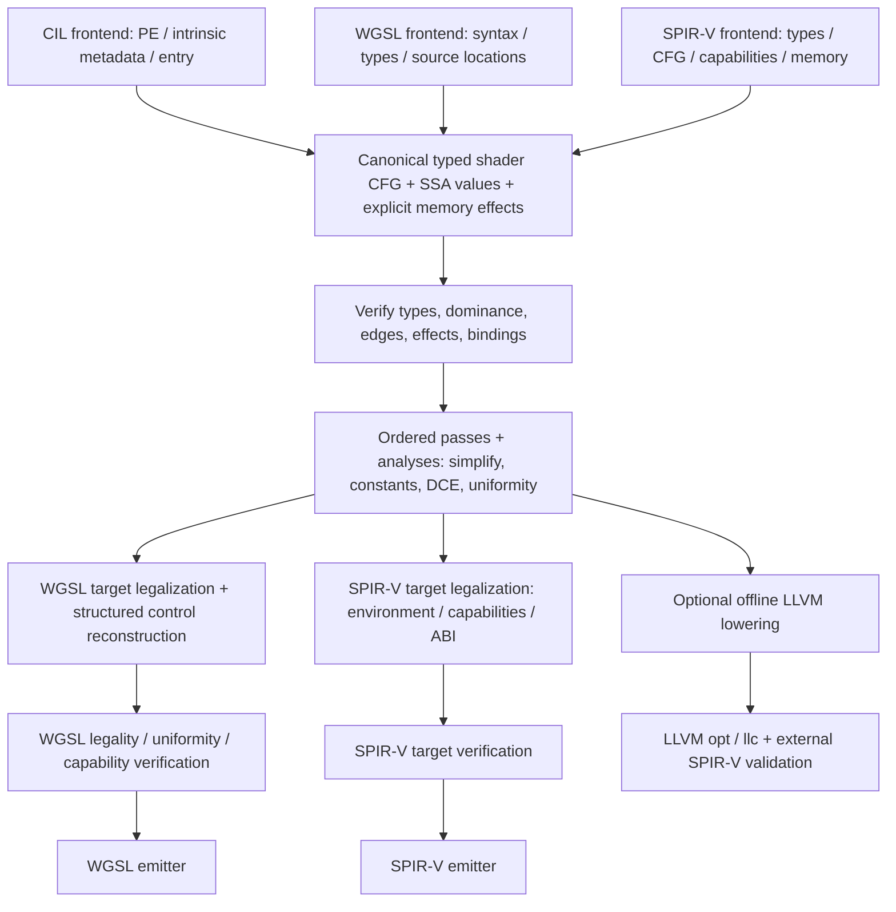

# Compiler improvement plan

Status: proposed staged design, 2026-10-08. The requested direction is an
independent compiler borrowing LLVM's separation of frontends, reusable analyses,
passes and target legalization. This document does not claim that the existing
translation IR has already been replaced. The [current architecture](compiler-architecture.md)
is the implementation baseline.

Latest integer graph migration (compiler/test source 61AFB62C…, GPU source
ACF40E1A…) constructs integer safety/remainder helpers directly as pure typed SSA.
Caller result identities, evaluated operands, edges/loops, spans and filters are
retained. Ordinary SPIR-V target preparation now keeps shared graphs through
integer/entry/layout lowering. Pipeline values, pointer/query helper declarations
and invocation termination retain an explicit temporary whole-module adapter;
WGSL target preparation also retains its structured path.
Twenty-one contracts and maintenance 2068/2068 pass; format 217/217 plus two pointer
formats, frozen input/output format 82/82, 160 reverse routes and 657 deterministic
files pass. Of 218 SPIR-V files, 105 match the previous batch and 113 change;
all 41 frozen inputs are retained, while only 12 replay outputs match bytewise.
GPU attempts are 122 PASS/30 ERROR: the six prior error categories and 24 newly
tested 16/64-bit consumer cases fail before execution. The 39 signed/unsigned,
ordered and vector cases and twelve 32-bit width/broadcast controls pass their
fixed raw-word oracles. Narrow integer WGSL enables/SPIR-V widths and 64-bit
casts/capability requirements remain compatibility work. Source manifests differ
only in the GPU fixture registrations; tested compiler/test files and all five
Compiler DLL copies match. Evidence is under canonical-integer-* in the workspace
task area. Constants/pointers/termination, WGSL target, initialization/mesh
constructors, deferrals, frontend/LLVM and full research/consumer gates remain open.

Previous canonical target entry migration (D27A86F6…) retains owned graphs through
the internal entry/physical-layout entrance, copying borrowed graphs before target
changes. Pure workgroup and output conversion helpers are constructed directly as
typed SSA; initialization retains its first captured graph. Explicit target
deferrals adapt the executable graph rather than an obsolete declaration body.
Ten new contracts and maintenance 2047/2047 pass, with independent format 217/217,
two pointer formats, frozen input/output format 82/82, 160 reverse routes and
657 deterministic files. Of 218 compared SPIR-V files, 211 match; seven workgroup
outputs change. All 41 frozen replay outputs match. GPU attempts are 71 PASS /
6 ERROR: three Vulkan memory-model imports, two original continuing WGSL name
redefinitions and one unresolved specialization-array import fail before execution.
The last artifact matches the preceding batch. Output conversion, raster policy
and resolved initialization readbacks pass. Evidence and original failed test/tool
runs are retained under canonical-target-entry-* in the workspace task area.
The shared ShaderTargetLowering entrance still reconstructs structured bodies
before constant/pointer/termination/integer passes. Initialization/mesh constructors,
deferrals, frontend/LLVM and full research/consumer gates remain open.

Previous uniform graph migration (779A518A…) captures target graphs before physical
type discovery and builds uniform read/selection helpers directly as CFG/SSA.
Captured indices, caller results, loop/edge topology, native memory operands and
diagnostic origins survive. Newly generated helpers propagate memory effects to
callers before mixed validation; structured access handles explicit deferrals.
Seven new contracts, related 91/91, maintenance 2037/2037, independent format
217/217 plus two pointer-return formats, frozen input/output format 82/82,
160 reverse routes and 657 deterministic files pass. Of 218 SPIR-V files, 214
match the previous batch and four uniform-layout outputs change; all 41 frozen
replay outputs match. GPU attempts are 32 PASS/5 ERROR: three existing Vulkan
memory-model imports and two newly observed original WGSL continuing-name
redefinitions fail before dispatch. Canonical continuing variants and nested
uniform selection/zero fallback return the expected values. Source/consumer
identities, failures and readbacks are recorded under uniform-graph-migration-*.
The shared canonical-to-target entrance, pure workgroup helper construction,
deferrals, frontend/LLVM and full research/consumer gates remain open.

Previous workgroup graph migration (11F49A83…) maps physical pointer signatures,
calls, returned addresses and edge arguments together, placing conversions at
ordered SSA accesses. Existing target graphs/labels survive entry and mesh
re-preparation. Seven contracts, maintenance 2030/2030, independent format
217/217 plus two raw pointer-return formats, frozen native input/output 82/82,
160 reverse routes and 657 deterministic files pass. GPU attempts are 24 PASS /
3 ERROR before execution. Of 218 compared SPIR-V files, 187 match; 31 regenerated
native inputs differ only by duplicate capability declarations, and all 41 frozen
replay outputs match. Uniform/deferred adapters, frontend/LLVM and the full
research/consumer gates remain open. Evidence is under workgroup-graph-migration-*.

Previous synchronization migration (7BCB90E0…) expands barriers, default atomics and
collective reads directly in target graphs after memory qualification. Twelve
contracts and maintenance 2023/2023 pass; independent format checks are 217/217,
frozen native input/output checks 82/82, reverse routes 160 PASS, and 657 repeated
files agree. All 218 prior SPIR-V artifacts and 41 replay outputs match. Targeted
GPU attempts are 24 PASS/3 ERROR: Vulkan memory-model Load/Store imports are
rejected before execution. Layout/pointers, frontend/LLVM and full research gates
remain open; this is partial stage-5 migration, not architecture completion.

Previous target memory qualification (F7382786…) consumes SSA address provenance
and keeps qualified access/atomic operands in target graphs. Graph call closure
inherits those memory effects; structured qualification handles explicit deferrals
only. Six new contracts, related 143/143 checks and maintenance 2011/2011 pass;
format checks are 217/217 and frozen native input/output checks 82/82. Reverse
routes pass 160/160, 657 repeated files agree, all 218 prior SPIR-V artifacts and
41 frozen replay outputs match. Current-source GPU and full consumers are not run.
Synchronization expansion, layout/pointers, frontend/LLVM and full research gates
remain open; this is partial stage-5 migration, not architecture completion.

Previous canonical-module validation (73488227…) uses owned graph instructions
and terminators for stage/call/payload closure while retaining declaration,
signature, entry and explicit deferred-body gates. Mixed effect summaries also
resolve owned graphs. The native frontend no longer reconstructs function bodies
before shared passes; its public Module remains an explicit output adapter.
Seven new contracts and related 345/345 checks pass; maintenance is 2005/2005,
format 217/217, reverse 160 PASS, determinism 657 files, and all 218 prior
SPIR-V artifacts match. Frozen native replay is recorded separately. Current-source
GPU and full consumers have not been rerun. Full direct frontend/target/LLVM
convergence and research acceptance remain unfinished.

Previous R3 (2FC5BD44…) handles native conditional exits to a known enclosing
selection merge in the structured adapter, keeping phi edge copies and ordered
effects. The exact optimized failing input also fails in frozen compiler 4347B236…;
the R2 failure attribution to llc was incorrect and its freeze produced no snapshot.
Related checks pass 134/134, complete maintenance 1998/1998, captured/reduced
input/output validation 6/6 and maintained format validation 217/217. GPU and
full consumer checks have not been rerun for this source. Direct graph consumers,
LLVM convergence and full research acceptance remain unfinished.

Previous canonical module progress: shared preparation returns owned CFG/SSA
graphs with explicit deferrals. Predecessor/dominance analyses are shared with
typed preservation, and call requirements are derived from graph bodies before
structured adaptation. Legacy Run and current target passes retain an explicit
structured adapter; direct frontend/target consumers still require migration.
F9289B01… evidence is 371/371 focused (including twelve new contracts), 1990/1992
maintenance checks (two missing-selection-merge diagnostics; earlier llc attribution corrected), 217/217 independent format checks,
descriptor 4/4, original-input replay 82/82, 160 reverse PASS, 657 deterministic
files and all 218 prior SPIR-V artifacts unchanged. Final-source GPU checks are 110 PASS/9 ERROR in 119 isolated attempts.
The three VMM, three loop-return WGSL and three specialization/LocalSizeId
imports remain unresolved without execution/readback; the latter match frozen
old-compiler bytes.
Stages 3/4/5/6/7 and the full research scope remain unfinished.

R2 evidence correction: freeze stopped before creating the snapshot/evidence files.
The exact failing optimized input also fails in frozen compiler 4347B236…
(input SHA-256 3DB8FEB375D9909C46B511CF93DC396A360FFDDE80D4BE7C0A68C478DA481FA4).
This is a newly exposed existing enclosing-selection-exit defect, not proof
of a regression introduced by canonical module preparation. Reproduction and
baseline records are in `.work/compiler-architecture-first/canonical-module-offline-*`.

Previous entry metadata progress: `SpirvEntryMetadataLowering` and
`SpirvSpecializationLowering` prepare execution modes, interface decorations and
requirements, workgroup specialization, override defaults/IDs and typed
specialization instructions. Internal emitters no longer accept write options.
An internal fixture's explicit default target was preserved in preparation;
all 214 prior SPIR-V artifacts remain identical. DF169F36… evidence has 13/13
focused checks, 1978/1980 maintenance checks (two llc failures), 217/217 format
checks, descriptor regressions 4/4, original-input replay 82/82, 160 reverse
PASS and 657 deterministic files. Final-source GPU is 110 PASS/9 ERROR in
119 attempts: the six prior VMM/loop-return imports and three existing
specialization/LocalSizeId imports, with exact frozen-old-compiler byte matches
for the latter. All nine WGSL entry routes pass; errors have no execution. Remaining
frontend/analysis/target-operation/LLVM/research/consumer gates retain the
original scope below; this is not an architecture completion claim.

Previous entry ABI progress: target legalization prepares canonical wrapper
CFG/SSA for interface effects, arguments, initialization, conversions and
mesh/task publication. Writer-owned execution-mode/capability policy and deferred
functions still require migration. C626BFA0… evidence is 1966/1968 maintenance
tests (two llc failures), 213/213 independent checks, descriptor regressions 4/4,
41 frozen original inputs replayed and validated 82/82, 156 reverse PASS and
640 deterministic files. Final-source GPU checks are 101 PASS/6 ERROR of 107,
including 27 new entry/raster executions passing. Three VMM and three loop-return
WGSL import errors remain; earlier-source reports are separate. The original
stage gates below remain unchanged.

2026-10-10 target CFG progress: target legalization prepares block order,
merge/continue and unreachable structural backedges; the new SPIR-V function
serializer consumes canonical edges and phi values directly. Entry wrappers,
ray-query guards, native pointer merges and frontend convergence still need work.
The original stage gates below are unchanged. E9696BE8… evidence is 1956/1958
maintenance tests (two llc failures), 210/210 format checks, 153 reverse routes,
628 deterministic files and 74 PASS/6 ERROR GPU attempts. Replaying 41 frozen
original inputs also validates input/output 82/82. The three new WGSL loop-return
consumer errors remain alongside the three VMM import errors; full acceptance
and research parity are not established.

2026-10-10 collective-read progress: native single-read regions recover collective
semantics only after shared CFG uniformity and actual helper-argument proof;
unproved regions fall back. CPU B14FA918…/GPU E950ABB0… differ only in GPU
registration/suffix; compiler/tests match. Focused 421/421, maintenance 1944/1946
(two llc), independent 202/202, 595 deterministic files, 145 reverse PASS,
33 GPU PASS/3 existing import ERRORs. Full original completion gates remain open.

2026-10-10 synchronization progress: default barrier/atomic operands and ordered
collective-load expansion are target IR; serializers consume explicit operands.
Source 94C7B3C8…: focused 447/447, maintenance 1929/1931 (two llc), independent
200/200, 586 deterministic files, 22 GPU PASS/3 existing import ERRORs. Two
reverse routes remain rejected by uniformity, reproduced on immutable baseline;
export remains FAILED. Collective result semantics and full original gates remain open.

2026-10-10 memory-access progress: target legalization prepares inherited
coherent/volatile access and atomic metadata; writer qualification/alias capture
is removed. Source 1DEA0CF5…: focused 323/323, maintenance 1916/1918 (two llc),
independent 197/197, 572 deterministic files, 155 prior SPIR-V/140 WGSL unchanged.
GPU attempts: 15 PASS and three VMM shader-import ERRORs, without execution.
Builtin/default memory algorithms, frontend/research/consumer gates remain open.

2026-10-10 workgroup access progress: physical globals/addresses and explicit
ordered conversion calls are prepared in target IR; writer WorkgroupLayout is
removed. Source 3ED2AE79…: focused 276/276, maintenance 1907/1909 (two llc
crashes), independent 196/196, 568 deterministic files and 15 native GPU PASS.
Existing 152 SPIR-V/137 WGSL outputs are identical. New alias/aggregate load
readbacks retain field/ABI/effect expectations. Memory/builtin/control-flow,
frontend, complete research and consumer gates remain open under original scope.

2026-10-10 mesh/task publication progress: synchronization, bounded counts,
distributed vertex/primitive copies and task termination now exist in typed target
IR. Shared effects/verifier/uniformity retain their constraints; the writer
serializes prepared helpers and interfaces. Source E143B33A…: focused 267/267,
maintenance 1899/1901 (two existing llc crashes), independent 193/193, 555 files
deterministic and six existing compute GPU controls PASS. Existing 131 WGSL outputs
and six same-input old compiler WGSL outputs are unchanged. Actual mesh/task GPU
execution is blocked by missing device extensions. These are migration evidence;
remaining target/frontend/research/consumer completion gates are unchanged.

2026-10-10 uniform access progress: dynamic column selection, alias index capture
and physical reads/construction are prepared as verified typed target helpers.
Continuing compound scope is preserved by the WGSL frontend. Source 8D734301…:
focused 154/154, maintenance 1879/1881 (two llc crashes), independent 187/187;
530 files deterministic. Selected GPU 25 attempts yield 21 PASS, two continuing
raw WGSL parser ERRORs and two shared WGSL fatal panics. Generated continuing
two-format and nested ABI/call-count readbacks pass. These advance extraction;
mesh/frontend convergence and the original full corpus/consumer gates remain open.
See uniform-legalization-final evidence and the architecture plan's uniform section.

2026-10-10 workgroup value conversion progress: pure typed aggregate to/from
helpers are prepared and verified in shared CFG; serialization calls the selected
function instead of recursively decomposing/reconstructing values. Memory access
order, qualifiers and borrowed input remain. Source BB7698C5…: focused 181/181,
maintenance 1871/1873 (two llc crashes), independent 185/185; selected GPU ten PASS
and two original Shared WGSL fatal panics in twelve attempts. Nested three-format
readbacks prove ABI field values and producer effect count one. Independent exporter
processes agree on 522 files. This advances target extraction; dynamic uniform/
alias control, mesh publication, full frontend/corpus/consumer gates remain open.
See workgroup-conversion-final evidence. The original stage gates below still apply.

2026-10-10 physical-layout preparation progress: internal target legalization
preselects physical/declaration types, uniform flattening/member indexes, distinct
workgroup identities and buffer byte decorations. Both entry emission and raw
fixture serialization consume an explicitly prepared frozen map; the latter no
longer accepts a bare module. No public API or dependency is added. Dynamic uniform
dispatch/alias capture, uniform reads and workgroup conversion still require
migration into verified target IR; mesh control and full frontend convergence
remain incomplete. Source B2ECEC53…: focused 243/243, maintenance 1867/1869 (two
llc crashes), independent 184/184; selected GPU seven PASS and two WGSL fatal
panics in nine attempts. Raw WGSL also panics, and frozen previous compiler outputs
match both new fixtures. Historical 141 binaries remain identical. The physical-
layout-final evidence retains failures and exact-source artifacts. These checks
do not replace any original stage gate or full research/consumer acceptance.

2026-10-10 workgroup-initialization progress: implicit zeroing is prepared as a
typed target helper with explicit stores, specialization loops and collective
barrier, verified/promoted in the shared CFG before target reconstruction.
Serialization invokes the prepared helper before the original entry body;
native inputs and opt-out retain their initialization behavior. Focused 145/145,
maintenance 1860/1862 (two LLVM crashes), independent validation 182/182; selected
native GPU 33 attempts give 30 PASS, one unresolved-array module rejection and
two AtomicSerial fatal panics. The unresolved-array consumer rejection also
occurs using the immutable prior compiler. This advances stages 4/5 without
completing physical-layout/mesh-control extraction, full frontend migration,
compatibility corpus or browser/SDK/Linux/AOT consumers. See current architecture
and workgroup-init-final evidence; the original stage gates below still apply.

2026-10-09 implementation progress: memory compilation now has a dedicated
`SpirvModuleCompilationRequest`, with the old options overload retained as an
adapter. Existing whole-module output passes are composed in
`Translation/Legalization/ShaderTargetLowering`, with verification at each
boundary; SPIR-V byte/word output shares one path. This starts stages 1/4/5
without completing them. The public IR remains structured and mutable. An internal
concrete scalar/vector/matrix/finite-array/structure CFG/SSA migration now runs
before both output pipelines, with dominance/edge/access/call-signature
verification, shader-entry call-graph reachability, typed data helper calls/returns,
shared numeric signature checks, builtin effect facts, local promotion and
deterministic before/after dumps. Temporary frontend and natural structured target
adapters bridge the existing structured IR. CFG merge/continuing annotations are
verified and preserved through passes; the target adapter no longer uses a
dispatcher. Nested loops, switch continue, continuing scope and break-if phi
snapshots have explicit regressions. Arbitrary CFG region discovery and full
uniformity remain pending; unmigrated functions are deferred
explicitly. This starts stages 2/3/4 without proving full frontend convergence.
Vertex/fragment data IO and maintained direct CIL math kernels now have actual
canonical migration checks. Atomic/workgroup synchronization and explicit texture
operations now migrate, retaining native barrier scopes and atomic success/failure
orders. Intrinsic convergence/resource requirements propagate through helper call
closures while calls remain conservative read/write effects. Abstract values,
opaque/atomic/cooperative local data still require
further legalization. Pointer helper parameters now migrate with their typed
address spaces/access, nested forwarding and ordered escaping slots. Shared
root-identity alias analysis rejects WGSL write aliases, including transitive
parameter/global accesses, while accepting readonly aliases. Native SPIR-V aliases
remain representable. Both target pipelines now expand pointer helper calls
with the shared helper inliner, retaining argument order and alias identity;
native function-pointer aliases have a representable expanded WGSL route.
SPIR-V serialization no longer copies each function-pointer pointee in and out;
target expansion retains shared addresses and ordered accesses.
Integer division safety and signed remainder expansion have moved from SPIR-V
serialization to verified target IR. The public guard option is consumed during
preparation, operands bind once in source order, and signed remainder retains its
existing expansion with guards disabled. Scalar/vector 16/32/64-bit types and
broadcasts use the same lowering. Coordinate/depth policy now selects verified
pure output functions in target legalization. Ordinary entry return values are
evaluated once; mesh field conversion remains after synchronization during output
publication. Serializer flags cannot change an already prepared result. This
advances target separation; initialization, feature, physical layout and mesh
publication/control construction still require extraction.
Resolved builtin identity now survives the structured adapter and CFG Call/Builtin
boundary, including frontend parsing, shared analysis, verification and both outputs.
User names do not select builtin folding or native query/memory transformations.
WGSL lexical disambiguation is a target pass; ordinary functions/locals may be
renamed, while entry and name-based override collisions diagnose to retain their
consumer contracts. This fixes the generated depth clamp shadowing regression,
without claiming complete frontend or target migration.
Block-level lexical diagnostic filters survive canonical instructions and helper
expansion, including callee defaults and continuing break-if expressions.
Target alias analysis now reads verified CFG instructions and SSA edge arguments;
root identities converge through selections and loop backedges. The same call
rules and read/write summaries serve structured source checks and canonical
target checks. Unmigrated families report analysis deferrals when requested;
static source legality still includes unreachable calls. Finite canonical pointer
block merges now lower to scalar address tags and captured indices, with parallel
loop-edge snapshots and shared selected-address memory dispatch. Helpers expand
before dispatch to preserve unconditional convergent operations. Called pointer-
return helpers now enter canonical IR and expand on verified CFG, binding SSA
arguments and joining actual returned addresses. Nonlocal exits leave nested
breakable regions without running remaining helper effects; per-call exit state
and local initialization reset at their dynamic positions. Promotion retains
addresses used by terminators and incoming edges. Allocation-only declaration
facts prevent duplicate native/volatile initialization stores, and uninitialized
contents cannot prove uniform zero. Callee diagnostic scopes and inherited/default
rules survive expansion without introducing attributes for equal defaults.
Eligible native pointer-return families now read the original SPIR-V directly,
capturing call results once and lowering returned/selected addresses through the
same verified CFG expansion. Native capability and root restrictions are checked
before address dispatch erases those facts. An internal native validation adapter
retains pointer parameters/select while the public WGSL gate remains unchanged.
Eligible native pointer-return and pointer-phi modules now share one importer for
original blocks, phi parameters,
edge arguments and merge/continue facts directly into the common CFG, reusing
only typed expression translation. Helpers and entry-call closure consume those
frontend graphs, independently of temporary structured metadata bodies. Return-only
modules no longer enter the Region/Edge adapter, and the legacy region reader no
longer duplicates native pointer-return decoding. Phi
predecessors/types are checked against actual native edges; simultaneous loop
swaps retain their captured addresses and indices. Shape/capability checks precede
metadata reconstruction; complete root checks follow helper binding and precede
address dispatch. Structured metadata/output adapters and native scalar-result
temporaries still remain. Function pointer slots now import explicit load/store
memory, CopyObject aliases and immutable loaded-address snapshots. Shared promotion
precedes metadata reconstruction and helper expansion, including modules with
pointer loads alone. Function slot helper arguments now bind to caller addresses
through the same canonical copier, including void/nested helpers and repeated
calls, followed by shared promotion before metadata reconstruction. Fully expanded
slot helpers are removed from that adapter; native signature mismatch diagnostics
remain explicit. Private/global slots retain explicit preflight deferrals;
remaining uninitialized, escaped or qualified slots defer based on shared IR facts.
Null/undefined, arithmetic/comparison, atomic/opaque/physical-matrix, descriptor
arrays, task terminators and native pointer libraries retain explicit old-route deferrals;
parse errors do not trigger fallback. Returned callee-local lifetimes, those native
families, emitter transformations and complete frontend convergence remain pending.
Ordinary scalar/data SPIR-V now uses the same direct native CFG import without
requiring pointer-return/phi/load instructions. Native scalar phi predecessors,
loop swaps, short-circuit reads, helper effects and captured indices are checked
through both outputs. Pending specialization-sized arrays retain an explicit
type-migration deferral and their specialization identity. The existing structured
expression adapter and target reconstruction remain temporary boundaries; this
does not complete stage 3 or the full native language/consumer matrix.
Native non-returning terminators are represented separately from returns, with
source spans, no successors and no invented result operands. Both reader paths,
helper copying and SPIR-V emission retain `OpUnreachable`; the WGSL legalizer
makes its undefined-path choice explicitly after helper expansion. Defined-path
effects, continuing iterations and both outputs require independent validation
and execution. Native invocation kill also retains separate convergence/termination
effects. Call summaries preserve non-returning control dependencies and normal-return
possibility; always-aborting paths supply no successor phi/memory contents.
After helper expansion, both target pipelines reconstruct continue constructs
containing native kill at the next loop header, with a first-iteration guard reset
on each entry. SSA captures retain body/continuing scope and break-if order;
native inputs, both outputs and fixed storage/color expectations are tested.
This does not finish task/invocation extensions, WGSL demotion, native lifetimes or
the remaining frontend/target migrations.
Shared local promotion now also accepts definitely initialized allocation-only
data and pointer slots, converting loaded addresses to SSA snapshots and loop
merges without inventing pointer zero values. Definite assignment accounts for
all predecessors and dynamic allocation resets. Uninitialized, escaping or
memory-qualified slots retain explicit memory operations. This is common IR
support; native load shape/capability checks precede promotion and roots are checked
before dispatch. Remaining slot families and full lifetime legalization are pending.
Uniformity analysis now also consumes verified CFG instructions and SSA edges
directly, reusing the address origins from alias analysis. Block control dependencies
distinguish reconvergence from iteration-crossing continue paths and early returns;
cyclic value/memory nodes carry loop and pointer-content dependencies. The structured
fallback shares builtin rules, input facts, diagnostic rules and helper summaries.
Explicit deferrals remain for unsupported families; full uniformity scopes and
frontend/target convergence remain pending.
Existing matrix alias fixtures now introduce the native alias
explicitly in IR after parsing distinct roots; their original native preservation
assertions remain intact. Effect classification does not prove uniformity or alias
legality; broad runtime coverage is not proof of full migration. Shared
control/value uniformity analysis now validates WGSL sources and both boundaries
of WGSL target preparation, including helper/pointer-content summaries and
branch/loop reconvergence. Proven single-invocation entry constants and
non-escaping zero-only private IO slots are exposed by target legalization.
Diagnostic-filter regressions now reject unfiltered uniformity failures even
when the historical reference validator disabled that check, as stage 5 requires.
Migrated functions use direct CFG analysis with a structured fallback; public warning delivery,
subgroup-uniformity scope extensions and complete canonical integration remain
pending. Three positive compute fixtures have canonical migration, independent
SPIR-V validation and GPU expected-result checks; this does not complete stage 5.
New memory/file requests now share an immutable target and common WebGPU/Vulkan
1.2/SPIR-V 1.5 defaults. Explicit managed writer targets constrain output versions,
stages, declared feature policies and used buffer limits; offline cache/manifests
include target identity. Legacy overloads retain their prior defaults through
adapters. This addresses the new-request common-default boundary, while full
CLI/SDK/translator cutover, normalized source origins, complete physical/environment
verification, target output/instruction policies and stable diagnostics remain pending.
Complete type/effect coverage and emitter layout/control extraction also remain pending.
Architecture work precedes further compatibility
expansion; existing regressions remain constraints during migration.

## Desired pipeline

IL -> WGSL and IL -> SPIR-V must share frontend semantics and middle-end passes.
WGSL -> SPIR-V and SPIR-V -> WGSL enter that same representation through their
own frontends. Native-only capabilities may survive SPIR-V -> IR -> SPIR-V while
SPIR-V -> WGSL rejects them. Roundtrip acceptance requires defined semantic
equivalence on the supported intersection, not identical text, IDs or bytecode.

LLVM's [code-generator layering](https://llvm.org/docs/CodeGenerator.html) is a
useful separation of common work and target lowering. Shader formats retain
binding, stage and structured-control constraints that require Sia's own semantic
model; forcing all shader paths through low-level LLVM IR would lose information
and require native tools in the managed runtime. LLVM remains an optional offline
backend. There is no proposed native LLVM runtime dependency or new Wasm loader.

## Semantic and target boundaries

Canonical values carry exact scalar width/signedness, vector/matrix shape and
logical aggregate type. Blocks have explicit terminators and predecessor/successor
edges; phi values or block arguments represent merges. Loads/stores/calls/atomics
retain effect order, address space, access rights, pointer provenance and memory
scope/order. Constants retain specialization dependencies. Preserve entry stage,
IO semantics, resource binding identity, logical layout and source origin.
WGSL syntax enables/diagnostic settings and SPIR-V decoration/opcode details live
at frontend/target boundaries, with semantic requirements translated explicitly.

Keep logical layout separate from physical uniform/storage/IO layout. Legalization
must not silently discard volatile/coherent/availability requirements, re-evaluate
indices, duplicate atomic effects or move convergent operations across control
flow. WGSL requires [uniformity analysis](https://www.w3.org/TR/WGSL/#uniformity-analysis);
SPIR-V emission must obey the selected
[environment and capability rules](https://registry.khronos.org/SPIR-V/specs/unified1/SPIRV.html).

A target description is immutable data combining output format, environment/version,
allowed capabilities/extensions, ABI, stage constraints and device resource limits.
The application host TFM and tool host RID stay outside it. Existing named variants
remain names mapped to profiles; they do not create a second target registry.
Defaults must be explicit per route and incompatible combinations rejected before
lowering. Direct SPIR-V options must actually constrain version/environment rather
than accepting an offline option that is ignored.

## Migration stages and completion gates

| Stage | Concrete change and code boundary | Acceptance before the next stage |
| --- | --- | --- |
| 0. Independent baseline (this PR) | Remove research archive, product dependency/names and manifest coupling; document all routes; preserve attribution and regression fixtures | No Naga bridge/runtime/CLI in compiler or SDK packs; four routes pass maintained checks; third-party backend scope stated explicitly |
| 1. Explicit compilation request and diagnostics | Separate memory compilation options from file/tool orchestration in `Compilation/`; normalize target data and source origin (CIL token/offset, WGSL span, SPIR-V word offset) | Invalid target/ABI/feature combinations fail early with stable diagnostics; file and memory paths use the same target defaults; no silent fallback |
| 2. Canonical CFG/SSA foundation | Add the minimum internal block/value/effect representation under Compiler; reuse CIL CFG decode and migrate constants/types incrementally | Verifier catches invalid dominance, merge arity/types, terminators, illegal memory access; deterministic IR dump; positive/negative fixtures for loop-carried values, switches and multiple exits |
| 3. Frontend convergence | CIL, WGSL and SPIR-V lower to canonical IR; temporary adapters isolate existing structured representation | All four routes operate on canonical IR; pointer/index captures and specialization semantics survive; remove adapters once consumers migrate; no second public IR API unless demonstrated necessary |
| 4. Shared analysis and pass composition | Extract transformations from readers/writers; start with reachability, dominance, call effects, constants, simplify CFG and dead code | Verify before/after passes; declared analysis invalidation; no effect/NaN/overflow changes; pass traces isolate failures; no extra global cache or plugin framework |
| 5. Target legalizers and control flow | Separate shared semantic legalization from WGSL/SPIR-V physical layout, pointer restrictions, structured merge/continue construction and uniformity | WGSL barriers/derivatives accepted only under proven rules; unrepresentable/reducibility cases diagnose; signedness, layouts, atomics and evaluation count preserved under external validation and execution |
| 6. Optional LLVM backend convergence | Lower canonical IR to LLVM for offline optimization; retire duplicated CIL semantics and move existing binary repair into identified target passes where practical | Managed and LLVM outputs agree against independent expected results; atomics/structured merges remain valid; every remaining repair has a reproduction and retirement condition |
| 7. Consumer and package cutover | Route CLI/SDK/direct APIs through common orchestration; retain host-only files/processes in offline boundary; update consumer examples/docs | Source/package/runtime browser consumers pass; target compatibility recorded in manifests/cache identities; no stale frontend/backend path or hidden second runtime |

The minimum control-flow/target legalization from stage 5 is a prerequisite for
the stage 3 dual-output gate; implement it with the first canonical slice rather
than waiting for all frontends to migrate. Temporary structured-IR adapters must
have fixture coverage and an explicit retirement point.

Do stages 1-3 before adding broad optimizations. Preserve the existing working
routes during migration and cut over one fixture family at a time. Do not build a
second permanent compiler or expose a pass plugin API for hypothetical consumers.
The first canonical slice should cover scalar compute, branch/loop merge values,
storage buffers and both writers; expand to helpers, vectors/matrices, raster IO,
textures and synchronization only after the slice passes.

## Pass and module organization

Proposed responsibilities inside the existing `Sia.Spirv.Compiler` assembly:

| Area | Allowed dependencies / migration |
| --- | --- |
| Frontends: CIL, WGSL, SPIR-V | Input syntax/metadata -> canonical IR; no output writer or host tool calls |
| IR + verifier | Types/values/blocks/effects and internal invariants; no parser, native tool or GPU dependencies |
| Analyses / transformations | IR -> analysis values or rewritten IR; declare consumed/preserved analyses |
| Target legalization | IR + target data -> verified legal IR; owns ABI/layout/control-flow lowering |
| Emitters | Legal IR -> bytes/text; serialization cannot hide feature-changing passes |
| Offline host | File/cache/manifest/tool process ownership; composes managed pipeline and LLVM |
| CLI / SDK / WebGPU adapter | Thin composition at use sites; no semantic transforms duplicated in consumers |

Use LLVM's [analysis invalidation model](https://llvm.org/docs/NewPassManager.html)
as a reference, scaled to actual Sia needs. Initially a fixed ordered list of
internal functions plus a per-compilation analysis context is enough. Each pass
records its name, input/output invariants and preservation result. Mutation is
owned by one compilation; avoid sharing mutable modules across compilations.
Target writers must produce repeatable outputs independent of the order in which
the other writer is called. No new package/dependency is required for these stages.

## Verification matrix

| Route / boundary | Required evidence |
| --- | --- |
| IL -> WGSL / IL -> SPIR-V | Shared positive/negative CIL fixtures; independent expected numeric/resource results; direct versus offline differential execution |
| WGSL -> SPIR-V | Standard WGSL type/uniformity rules, overrides/defaults, environment-specific `spirv-val`, runtime output checks |
| SPIR-V -> WGSL | Native capability/memory/pointer fixtures; explicit unsupported diagnostics; browser WebGPU validation and execution on representable intersection |
| Every pass | Minimal regression for changed behavior; verifier before/after; deterministic dumps and effect/evaluation-order checks |
| Numeric semantics | Signed/unsigned widths, shifts, division/remainder, overflow, NaNs/infinity, rounding, casts and constant/runtime agreement |
| Memory/control flow | Physical offsets/stride, aliases and captured indices, branch/loop merges, barriers, atomic order/scope, workgroup initialization |
| Raster/texture path | Stage IO/builtins, matrix convention, texture load/sample/query and GPU pixel comparisons |
| Packaging/hosts | Compiler/SDK/native package contents, offline host binaries, extracted SDK consumer, one application Wasm runtime, trimmed and AOT host checks |

Self-roundtrip parsing alone is insufficient: reader and writer can share a defect.
Use SPIRV-Tools, browser/device validators and specified expected execution values.
Historical reference-oracle checks can inform regressions but do not define Sia's
semantics or block progress on another compiler's bugs. Every result must identify
revision, target options, tool versions and actual execution host. Unsupported
features remain visible; do not fabricate entry points, relax validation or lower
capabilities merely to make a test green.

Current evidence gaps include broad arbitrary CIL, complete uniformity, concurrent
barrier ordering, raster/texture/matrix pixel equivalence, Linux package execution
and Wasm AOT. Resolve these gates before claiming broad feature parity or backend
replacement. Performance claims need compile-time/allocation/code-size and GPU
timing measurements on the same fixture/target, after semantic checks pass.
