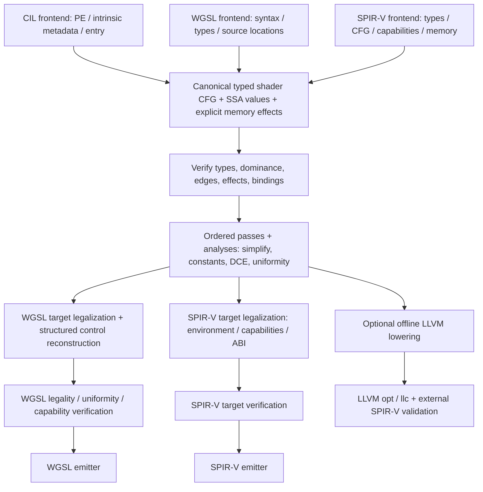

# Compiler improvement plan

Status: proposed staged design, 2026-10-08. The requested direction is an
independent compiler borrowing LLVM's separation of frontends, reusable analyses,
passes and target legalization. This document does not claim that the existing
translation IR has already been replaced. The [current architecture](compiler-architecture.md)
is the implementation baseline.

## Desired pipeline

IL -> WGSL and IL -> SPIR-V must share frontend semantics and middle-end passes.
WGSL -> SPIR-V and SPIR-V -> WGSL enter that same representation through their
own frontends. Native-only capabilities may survive SPIR-V -> IR -> SPIR-V while
SPIR-V -> WGSL rejects them. Roundtrip acceptance requires defined semantic
equivalence on the supported intersection, not identical text, IDs or bytecode.

LLVM's [code-generator layering](https://llvm.org/docs/CodeGenerator.html) is a
useful separation of common work and target lowering. Shader formats retain
binding, stage and structured-control constraints that require Sia's own semantic
model; forcing all shader paths through low-level LLVM IR would lose information
and require native tools in the managed runtime. LLVM remains an optional offline
backend. There is no proposed native LLVM runtime dependency or new Wasm loader.

## Semantic and target boundaries

Canonical values carry exact scalar width/signedness, vector/matrix shape and
logical aggregate type. Blocks have explicit terminators and predecessor/successor
edges; phi values or block arguments represent merges. Loads/stores/calls/atomics
retain effect order, address space, access rights, pointer provenance and memory
scope/order. Constants retain specialization dependencies. Preserve entry stage,
IO semantics, resource binding identity, logical layout and source origin.
WGSL syntax enables/diagnostic settings and SPIR-V decoration/opcode details live
at frontend/target boundaries, with semantic requirements translated explicitly.

Keep logical layout separate from physical uniform/storage/IO layout. Legalization
must not silently discard volatile/coherent/availability requirements, re-evaluate
indices, duplicate atomic effects or move convergent operations across control
flow. WGSL requires [uniformity analysis](https://www.w3.org/TR/WGSL/#uniformity-analysis);
SPIR-V emission must obey the selected
[environment and capability rules](https://registry.khronos.org/SPIR-V/specs/unified1/SPIRV.html).

A target description is immutable data combining output format, environment/version,
allowed capabilities/extensions, ABI, stage constraints and device resource limits.
The application host TFM and tool host RID stay outside it. Existing named variants
remain names mapped to profiles; they do not create a second target registry.
Defaults must be explicit per route and incompatible combinations rejected before
lowering. Direct SPIR-V options must actually constrain version/environment rather
than accepting an offline option that is ignored.

## Migration stages and completion gates

| Stage | Concrete change and code boundary | Acceptance before the next stage |
| --- | --- | --- |
| 0. Independent baseline (this PR) | Remove research archive, product dependency/names and manifest coupling; document all routes; preserve regression fixtures | No Naga bridge/runtime/CLI in compiler or SDK packs; four routes pass maintained checks; third-party backend scope stated explicitly |
| 1. Explicit compilation request and diagnostics | Separate memory compilation options from file/tool orchestration in `Compilation/`; normalize target data and source origin (CIL token/offset, WGSL span, SPIR-V word offset) | Invalid target/ABI/feature combinations fail early with stable diagnostics; file and memory paths use the same target defaults; no silent fallback |
| 2. Canonical CFG/SSA foundation | Add the minimum internal block/value/effect representation under Compiler; reuse CIL CFG decode and migrate constants/types incrementally | Verifier catches invalid dominance, merge arity/types, terminators, illegal memory access; deterministic IR dump; positive/negative fixtures for loop-carried values, switches and multiple exits |
| 3. Frontend convergence | CIL, WGSL and SPIR-V lower to canonical IR; temporary adapters isolate existing structured representation | All four routes operate on canonical IR; pointer/index captures and specialization semantics survive; remove adapters once consumers migrate; no second public IR API unless demonstrated necessary |
| 4. Shared analysis and pass composition | Extract transformations from readers/writers; start with reachability, dominance, call effects, constants, simplify CFG and dead code | Verify before/after passes; declared analysis invalidation; no effect/NaN/overflow changes; pass traces isolate failures; no extra global cache or plugin framework |
| 5. Target legalizers and control flow | Separate shared semantic legalization from WGSL/SPIR-V physical layout, pointer restrictions, structured merge/continue construction and uniformity | WGSL barriers/derivatives accepted only under proven rules; unrepresentable/reducibility cases diagnose; signedness, layouts, atomics and evaluation count preserved under external validation and execution |
| 6. Optional LLVM backend convergence | Lower canonical IR to LLVM for offline optimization; retire duplicated CIL semantics and move existing binary repair into identified target passes where practical | Managed and LLVM outputs agree against independent expected results; atomics/structured merges remain valid; every remaining repair has a reproduction and retirement condition |
| 7. Consumer and package cutover | Route CLI/SDK/direct APIs through common orchestration; retain host-only files/processes in offline boundary; update consumer examples/docs | Source/package/runtime browser consumers pass; target compatibility recorded in manifests/cache identities; no stale frontend/backend path or hidden second runtime |

Do stages 1-3 before adding broad optimizations. Preserve the existing working
routes during migration and cut over one fixture family at a time. Do not build a
second permanent compiler or expose a pass plugin API for hypothetical consumers.
The first canonical slice should cover scalar compute, branch/loop merge values,
storage buffers and both writers; expand to helpers, vectors/matrices, raster IO,
textures and synchronization only after the slice passes.

## Pass and module organization

Proposed responsibilities inside the existing `Sia.Spirv.Compiler` assembly:

| Area | Allowed dependencies / migration |
| --- | --- |
| Frontends: CIL, WGSL, SPIR-V | Input syntax/metadata -> canonical IR; no output writer or host tool calls |
| IR + verifier | Types/values/blocks/effects and internal invariants; no parser, native tool or GPU dependencies |
| Analyses / transformations | IR -> analysis values or rewritten IR; declare consumed/preserved analyses |
| Target legalization | IR + target data -> verified legal IR; owns ABI/layout/control-flow lowering |
| Emitters | Legal IR -> bytes/text; serialization cannot hide feature-changing passes |
| Offline host | File/cache/manifest/tool process ownership; composes managed pipeline and LLVM |
| CLI / SDK / WebGPU adapter | Thin composition at use sites; no semantic transforms duplicated in consumers |

Use LLVM's [analysis invalidation model](https://llvm.org/docs/NewPassManager.html)
as a reference, scaled to actual Sia needs. Initially a fixed ordered list of
internal functions plus a per-compilation analysis context is enough. Each pass
records its name, input/output invariants and preservation result. Mutation is
owned by one compilation; avoid sharing mutable modules across compilations.
Target writers must produce repeatable outputs independent of the order in which
the other writer is called. No new package/dependency is required for these stages.

## Verification matrix

| Route / boundary | Required evidence |
| --- | --- |
| IL -> WGSL / IL -> SPIR-V | Shared positive/negative CIL fixtures; independent expected numeric/resource results; direct versus offline differential execution |
| WGSL -> SPIR-V | Standard WGSL type/uniformity rules, overrides/defaults, environment-specific `spirv-val`, runtime output checks |
| SPIR-V -> WGSL | Native capability/memory/pointer fixtures; explicit unsupported diagnostics; browser WebGPU validation and execution on representable intersection |
| Every pass | Minimal regression for changed behavior; verifier before/after; deterministic dumps and effect/evaluation-order checks |
| Numeric semantics | Signed/unsigned widths, shifts, division/remainder, overflow, NaNs/infinity, rounding, casts and constant/runtime agreement |
| Memory/control flow | Physical offsets/stride, aliases and captured indices, branch/loop merges, barriers, atomic order/scope, workgroup initialization |
| Raster/texture path | Stage IO/builtins, matrix convention, texture load/sample/query and GPU pixel comparisons |
| Packaging/hosts | Compiler/SDK/native package contents, offline host binaries, extracted SDK consumer, one application Wasm runtime, trimmed and AOT host checks |

Self-roundtrip parsing alone is insufficient: reader and writer can share a defect.
Use SPIRV-Tools, browser/device validators and specified expected execution values.
Historical reference-oracle checks can inform regressions but do not define Sia's
semantics or block progress on another compiler's bugs. Every result must identify
revision, target options, tool versions and actual execution host. Unsupported
features remain visible; do not fabricate entry points, relax validation or lower
capabilities merely to make a test green.

Current evidence gaps include broad arbitrary CIL, complete uniformity, concurrent
barrier ordering, raster/texture/matrix pixel equivalence, Linux package execution
and Wasm AOT. Resolve these gates before claiming broad feature parity or backend
replacement. Performance claims need compile-time/allocation/code-size and GPU
timing measurements on the same fixture/target, after semantic checks pass.
